---
format:
  revealjs:
    number-sections: true
    number-depth: 1
    incremental: true
    standalone: true
    theme: blood
    margin: 0.01
    smaller: true
    scrollable: true
    slide-number: true
    link-external-icon: true
    chalkboard: true
    logo: img/LO_GU_cen2rNEG.png
    toc: true
    toc-title: Agenda
    toc-depth: 1
    preview-links: true
    touch: true
    multiplex: true
revealjs-plugins:
  - pointer
include-in-header:
  - text: |
      <style>
      .reveal .slide-logo {
        max-height: unset;
        height: 100px;
      }
      </style>
title: Hälsovetenskaplig statistik
subtitle: LÄA110 (V26)
institute: Avdelningen för samhällsmedicin och folkhälsa
author: Erik Bülow
editor: 
  markdown: 
    wrap: 72
---

# Formalia

## Upplägg

Föreläsningar

:   3 stycken (studiedesign, deskriptiv statistik, tester, regression
    etc).

Projektplaneringsseminarium

:   Statistiker deltar

Datorövningar

:   anmäls i förväg via Canvas

:   SPSS-introduktion

:   Frågeformulär -- design och analys

:   Statistiska test: t-test, ANOVA, icke-parametriska test

:   Regressionsanalys

:   R

Workshops

:   Bokas i förväg vid 2 tillfällen

:   Jobba med din egen data till projektet

::: notes
Så här är statistikdelen av kursen organiserad, vi kommer att ha 3
introduktions...

Under de tre sessionerna kommer mitt fokus att vara att introducera
grundläggande statistik, begrepp och principer bakom några vanligt
förekommande statistiska analysmetoder inom medicinsk forskning.
Medicinsk forskning kan vara klinisk forskning, laboratorieforskning
eller epidemiologiska studier.

Det viktigaste under föreläsningarna kommer att vara de grundläggande
principerna inom medicinsk statistik och viss vägledning.
:::

## Föreläsningar

| Föreläsning | Pass | Avsnitt | Titel                |
|-------------|------|---------|----------------------|
| 1           | 1    | 1       | Formalia             |
|             |      | 2       | Intro                |
|             |      | 3       | Population och urval |
|             | 2    | 4       | Begrepp              |
|             |      | 5       | Deskriptiv statistik |
|             | 3    | 6       | Inferens             |
| 2           | 1    | 7       | p-värden             |
|             |      | 8       | Stickprovsstorlek    |
|             |      | 9       | Multipla test        |
|             | 2    | 10      | Vanliga test         |
|             | 3    | 11      | Korrelation          |
| 3           | 1    | 12      | Regression           |
|             | 2    | 13      | Kvalitativt utfall   |
|             |      | 14      | Överlevnadsanalys    |
|             | 2    | 15      | Datastruktur         |
|             |      | 16      | Forskningsfrågan     |
|             |      | 17      | Studie-design        |

## 

::: callout-important
## Viktigt!

-   Det räcker inte att gå på föreläsningarna!
-   Gå igenom föreläsningsbilder + rekommenderad litteratur + Jon och Agnes statistikskola.
-   Du kommer också behöva praktisk övning: försöka lösa övningarna i
    boken och delta vid datorsessioner
-   Just ditt projekt kanske kräver andra metoder än de som tas upp här (eller går det att förenkla?).
:::

## Rekommenderad litteratur

::: {layout-ncol="4"}
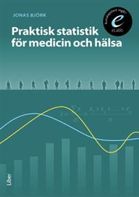{height="400"}

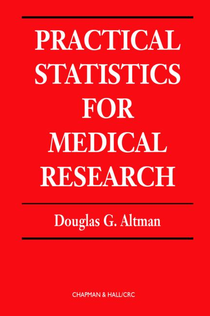{height="400"}

[{height="400"}](https://ebookcentral.proquest.com/lib/gu/detail.action?docID=1355799)

[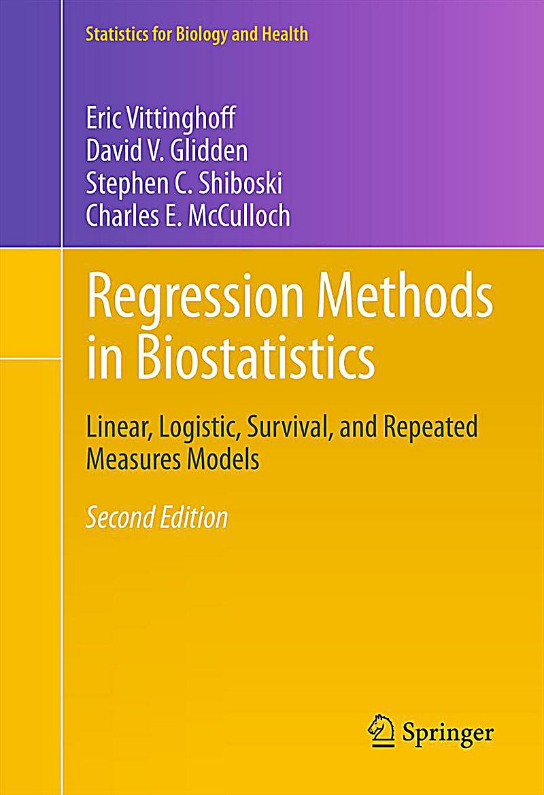{height="400"}](https://ebookcentral.proquest.com/lib/gu/detail.action?pq-origsite=primo&docID=973179)
:::

-   [Online resource to learn SPSS](https://stats.oarc.ucla.edu/spss/)
-   [Online resource to learn STATA](https://stats.oarc.ucla.edu/stata/)

::: notes
Search the books (3 & 4) in GU-Library and navigate further to read
online

In Swedish = PRAKTISK STATISTIK FÖR MEDICIN OCH HÄLSA" by Jonas Björk A
good introduction to basic statistics

Vittinghoff. E.. Glidden. D.. Shiboski. S.. & McCulloch. C. (2012) is a
gentle & detail introduction to Regression analysis with STATA
Regression Methods in Biostatistics (Statistics for Biology and Health).
Boston. MA: Springer US.
:::

## Youtube






# Intro

## Varför statistik?

-   Exempel: Förekomst av hjärt- och kärlsjukdomar via `stickprov`
    -   Landsbyggd: 91 av 4 920 = 1,85%
    -   Stad: 64 av 4965 = 1,29 %
-   Hur tolkar vi dessa resultat?
-   Tror du att det finns ett samband mellan boende och CVD?

::: notes
Låt oss titta på ett exempel från epidemiologin för hjärt- och
kärlsjukdomar.

En grupp mellan 25-74 år analyserades. Deltagarna klassificerades som
följande: - Landsbygd = samhälle med färre än 10 000 invånare -
Stad/mellanstor stad = samhälle med fler än 10 000 invånare och färre än
50 000 invånare - Storstad = samhälle med över 50 000 invånare

Fokus låg på skillnaden mellan landsbygd och storstad samt förekomsten
av hjärt- och kärlsjukdomar. Resultaten visade att: - På landsbygden
hade 91 av 4920 individer hjärt- och kärlsjukdomar. - I storstaden hade
64 av 4965 individer hjärt- och kärlsjukdomar.

Hur tolkar du dessa resultat? Tror du att det finns ett samband mellan
boende och förekomst av hjärt- och kärlsjukdomar?

Om vi hade haft 80 respektive 75 fall av hjärt- och kärlsjukdomar på
landsbygden och i storstaden, skulle vi ha trott att det inte finns
något samband och att denna lilla skillnad beror på slumpen. Om vi
däremot hade haft 145 respektive 10 fall av hjärt- och kärlsjukdomar på
landsbygden och i storstaden, skulle vi ha trott att det finns ett
samband.

Men med den givna situationen kan vi inte fatta beslut med hjälp av vår
enkla intuition. Vi måste använda statistisk teori för att besvara vår
forskningsfråga.
:::

## Därför statistik!

-   `Oberoende variabel`/prediktor = Bosättningsort (stad/landsbygd)
-   `Beroende variabel`/utfall = CVD (Ja eller Nej)

::: fragment
|           | CVD        | Inte CVD | Totalt |
|-----------|------------|----------|--------|
| Stad      | 91 (1,9 %) | 4829     | 4920   |
| Landsbygd | 64 (1,3 %) | 4901     | 4965   |
:::

-   Skillnad i andel = $0,5$ `procentenheter`
-   95 % `konfidensintervall`: $(0,07~\%; 1,05~\%)$
-   $\chi^2$-`test` ($p = 0,02$)
-   Är detta kliniskt relevant?

::: notes
Är 0,5% kliniskt relevant?

En provgrupp mellan 25-74 år analyserades. Deltagarna klassificerades
som följande: - Landsbygd = samhälle med färre än 10 000 invånare -
Stad/mellanstor stad = samhälle med fler än 10 000 invånare och färre än
50 000 invånare
:::

## Totalundersökning

-   Nu med hela Sveriges befolkning (vid ngn tidpunkt)

::: fragment
|           | CVD               | Totalt      | Förväntat         |
|-----------|-------------------|-------------|-------------------|
| Stad      | $45~276~(1,9~\%)$ | $2~447~909$ | $36~572~(1,5~\%)$ |
| Landsbygd | $54~744~(1,3~\%)$ | $4~246~925$ | $63~449~(1,5~\%)$ |
:::

-   8 705 fler fall i stad jmfrt. förväntat om lika risk (45 276 - 36
    572) 
-   $\chi^2 = 3315,73$
-   $P = 0,00000...$

::: notes
Relevant med statistiska metoder i detta fall? Ev om man ser det som ett
urval från en teoretisk super-population etc.
:::

## Vad är statistik?

-   Vetenskap som studerar de metoder som krävs för att sammanställa,
    analysera och tolka `data`.

-   Inom forskningen kan statistisk teori användas som en hjälp när man
    konstruerar studier, samlar in data och drar slutsatser.

-   `Hälsovetenskaplig statistik` handlar om tillämpningar av statistik
    inom medicin, hälsovetenskap, epidemiologi, odontologi ...

::: callout-note
## Matematisk statistik

-   `Matematisk statistik` är en gren inom matematik.
-   Inom `statistik` tillämpas metoder från matematisk statistik.
-   "Stat" i statistik kommer från en tillämpning inom statsvetenskap
    etc.
:::

::: notes
I forskningsprojekt följer vi generellt följande steg:

Planering -\> Design (urval, beräkning av urvalsstorlek) -\>
Datainsamling -\> Analys -\> Resultat -\> Tolkning -\> Presentation

Statistisk kunskap och tänkande bidrar redan i planerings- och
designfasen av forskningsprojekt.

Statistik är mycket hjälpsamt redan från allra första början av
forskningsarbete, vid beslut om studiedesign, beräkning av
urvalsstorlek.
:::

## Varför statistik?

-   Det finns en `variation` i data

-   Praktiskt och/eller etiskt omöjligt att samla in data från hela
    befolkningen

-   Hur hanterar man `osäkerhet` i ett stickprov?

-   Hur använder man det vi observerar i ett `urval` för att dra
    slutsatser om en `population`?

# Population och urval

##  {background-image="img/EB_V24_14.png" background-size="contain"}

::: notes
Statistik är användbart och nödvändigt i situationer när vi förväntar
oss en variation i resultat. Vad betyder det att ha "en variation i
resultaten"?

Kunskap i statistik hjälper oss också att kritiskt analysera resultat
från andra forskares projekt.

Urvalsundersökningar används för att dra slutsatser om en stor
population genom att analysera data från en mindre del av populationen.

Att använda urval medför en viss grad av statistisk osäkerhet! Resultat
vi observerar kan vara på grund av slumpen.

Det vi observerar i ett urval (medelhöjden, förbättringen av en
tillstånd på grund av en behandling) återspeglar inte automatiskt vad
som händer i den allmänna populationen, om inte urvalet är väl valt (i
så fall kallas det representativt för populationen).
:::

##  {background-image="img/Skärmavbild%202023-12-26%20kl.%2021.17.02.png" background-size="contain"}

::: notes
Observera att populationsparametrar ofta betecknas med grekiska
bokstäver, medan latinska bokstäver ofta används för urvalsstatistik.

Ett vanligt mål med statistisk analys är att producera information eller
dra slutsatser om en vald population baserat på egenskaper hos urvalet.
:::

## Population och urval

::: columns
::: {.column width="50%"}
-   `Population`
-   `Urvalsram` (Sampling frame)
-   `Urval` (Sample)
-   `Urvalsenhet` (Sampling observation)
-   `Urvalsmetod` (Sampling method)
-   `Bortfall` (Drop out)
:::

::: {.column width="50%"}
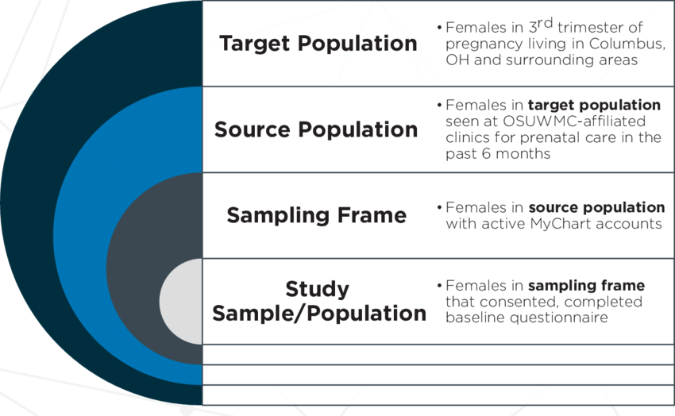
:::
:::

::: notes
Låt oss diskutera några viktiga statistiska termer (definitioner) och se
vad som kan gå fel vid urval.

Populationen är en uppsättning liknande enheter av intresse för en
forskningsfråga eller resultatet av ett experiment. Vid statistisk
inferens väljs en statistiskt representativt urval för att representera
populationen i en statistisk analys. Statistisk inferens hjälper oss att
uppskatta populationsparametrar med hjälp av lämpliga urvalsstatistik.

Urval är valet av ett urval från populationen för att uppskatta
egenskaper hos hela populationen. Vi väljer urvalsenheter
(observationer) från en urvalsram, som kan ha under- eller övertäckning.

Det kan bero på tidsfördröjningar mellan det ögonblick då urvalsramen
skapades och när den faktiskt användes; att inte inkludera
nyfödda/invandring i ramen; att inte ta bort avlidna/utvandring. Under
täckning innebär att inte alla enheter från vår statistiska population
inkluderas. Över täckning innebär att vår urvalsram består av element
som inte tillhör vår målpopulation.
:::

## Över- och undertäckning

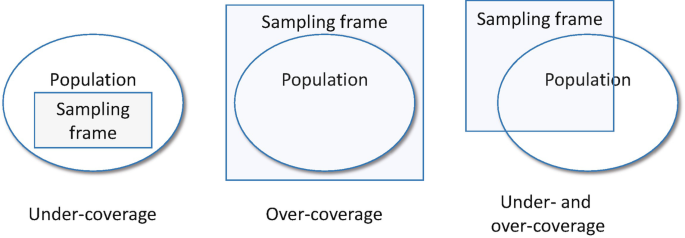

Hanteras via `inklusions-` och `exklusionskriterier`.

## Urvalsmetoder

-   Obundet slumpmässigt urval
-   Systematiskt urval
-   Stratifierat urval
-   Klusterurval
-   Frivilligt deltagande
-   Snöbollsurval
-   Bekvämlighetsurval

::: notes
https://sv.surveymonkey.com/market-research/resources/types-of-sampling/

Ett slumpmässigt urval är grundläggande för statistisk inferens. En
guldstandard när man drar ett urval är att vara: - Opåverkad: Varje
individ i populationen har lika stor möjlighet att bli vald i urvalet. -
Oberoende: Valet av en individ är helt oberoende av de andra individer
som finns i urvalet. Motexempel: Du väljer personer i ditt urval och för
de som är gifta inkluderar du också deras partner. Då är varje par av
två personer beroende av varandra.

I ett enkelt slumpmässigt urval (ESU) har varje individ i populationen
lika stor möjlighet att bli vald till urvalet. En "guldstandard". ESU
kallas Obundet Slumpmässigt Urval (OSU) på svenska.

Systematiskt urval innebär att välja element från en urvalsram på ett
systematiskt sätt. Exempelvis var tredje student, var tionde person i
patient-/befolkningsregistret.

Vid stratifierat urval delas populationen upp i icke-överlappande
delpopulationer som kallas strata, och ett antal individer väljs sedan
slumpmässigt från varje stratum. Exempelvis alla flickors namn i en urna
och alla pojkars namn i en annan urna, och sedan ett ESU från varje
urna.

Vid klusterurval delas populationen upp i redan bildade undergrupper
(kluster), och ett urval av sådana kluster dras. Antingen väljs hela
klustren eller ett ESU från varje kluster. Klusterurval används normalt
när det är mer praktiskt att välja en grupp individer istället för
enskilda individer. Detta kan vara fallet om du vill välja skolbarn i
hela landet och behöver träffa dem personligen. 1000 enskilda barn som
väljs skulle vara utspridda över hela landet, men att välja 40
skolklasser med 25 barn i varje skulle förenkla datainsamlingen.

Frivilligt urval: Frivilliga väljer att delta i en undersökning. Vem är
de? Representerar de vår population? Bekvämlighetsurval: Urvalet görs
från den del av populationen som är lättillgänglig.
:::

## Bortfall

-   Objektbortfall (individbortfall)
-   Partiellt bortfall (variabelbortfall)
-   Drop-out
-   Systematiskt bortfall?
    -   Missing completely at random (MCAR)
    -   Halkade på bananskal och slog sönder ett provrör
    -   Missing at random (MAR)
        -   rapportering saknas från en vårdenhet
    -   Missing not at random (MNAR)
        -   Rökare vill inte berätta att de röker \##

::: callout-important
## Viktigt!

-   Slutsatserna är aldrig bättre än urvalet.
-   Var alltid tydlig med vilken eller vilka populationer din statistik
    är tänkt att generalisera till.
-   Antyd inte att ditt urval generaliseras till alla om ditt stickprov
    inte var representativt för hela populationen!
    -   T.ex. om ditt urval endast inkluderade medicinska
        högskolestudenter, kan du inte generalisera dina resultat till
        alla studenter
:::

# Begrepp

## 

::: callout-note
## Notation

-   Statistik använder matematik
-   Matematisk notation är ibland rena grekiskan!
-   Vi undviker komplicerade formler i de flesta fall
-   Några symboler återkommer dock ofta och kan vara bra att känna till
:::

X

:   Oberoende variabel

Y

:   Beroende variabel

$i, j, k, l$

:   Används ofta som index (naturliga tal)

$x_i, y_i$

:   Specifik observation från variabel $X, Y$

$n, N$

:   Stickprovsstorlek

$\Sigma$

:   Används för summaberäkningar, t ex $\Sigma_{i=1}^n x_i$ = summan av
    alla observationer från variabel $X$

$\mu$

:   betecknar ofta ett "teoretiskt/abstrakt/okänt" `medelvärde` i en
    population

$\bar x$

:   Medelvärdet av $X$, $\bar x = \Sigma_{i=1}^n x_i / n$

:   Dvs, ett värde som kan beräknas utifrån observerad data

:   Approximerar $\mu$

$\sigma$

:   betecknar ofta en "teoretisk/abstrakt/okänd" `standardavvikelse` i
    en population

$s$

:   Beräknas utifrån data

:   Approximerar $\sigma$

$\alpha$

:   Signifikansnivå (sannolikheten för typ I-fel)

:   Även intercept i Regression

$\beta$

:   Sannolikheten för typ II-Fel

:   Även koefficient i regressionsmodell

## Grundläggande

Parameter

:   ett "sant" men ofta okänt värde som beskriver populationen

:   T ex: medelvärde ($\mu$), standardavvikelse ($\sigma$)

Statistika (singular)

:   ett tal som beskriver stickprovet.

:   Statistikans värde är känt när urvalet analyserats

:   varierar från stickprov till stickprov

:   T ex: medelvärdet ($\bar x$), standardavvikelse ($s$)

Parameterskattning:

:   Ofta används en statistika (eller en funktion av denna) för att göra
    en skattning av en okänd parameter.

:   $\bar x \approx \mu$ och $s \approx \sigma$

::: notes
numeric summary = beräknas från datan

Populationsparametrar är beskrivande statistik (numerisk summering) av
någon egenskap hos en population (t.ex. populationsmedelvärdet).
Stickprovsstatistik (singular) är beskrivande statistiksummering av
någon egenskap hos ett stickprov (t.ex. stickprovsmedelvärdet).
Parameterskattningar är stickprovspecifika egenskaper (statistik) som vi
antar som skattningar/representanter för populationsparametrarna.
:::

## Variabel

-   Karakteristik för ett objekt som kan kvantifieras (mätas) och som
    kan variera, mellan eller/och inom objekt (till skillnad från en
    konstant som alltid har samma värde)
-   `Oberoende variabel` mäts, manipuleras eller väljs i syfte att
    bestämma dess relation till den beroende variabeln.
-   Den `beroende variabeln` (utfallet) är ofta "stjärnan i showen".
-   Syftet med vår studie är vanligtvis att svara på om det finns en
    samvariation mellan utfallsvariabeln och våra oberoende variabler.

##  {background-image="img/EB_V24_19.png" background-size="contain"}

::: notes
Kvantitativa data: baseras på data som kan mätas. Exempelvis
blodtrycksmätningar, antal graviditeter, kroppsvikt.

Kontinuerliga: möjliga värden är oändliga (Sv: obegränsat) Diskreta: det
finns ett ändligt antal möjliga värden (man kan beräkna antalet möjliga
värden) - Till exempel: antal graviditeter

Kvalitativa/kategoriska data baseras på data som kan beskrivas.
Exempelvis kvaliteten på sömnen (dålig/acceptabel/mycket bra), rökstatus
(ja/nej)
:::

## Mätnivåer

::: columns
::: {.column width="50%"}
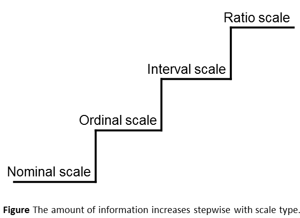
:::

::: {.column width="50%"}

Nominalskala (kategorisk; saknar ordnning)

:   namn, kön, färg, varumärke, ...

Ordinalskala (kategorisk; ordning)

:   Bra-Bättre-Bäst, ålderskategori, ...

Intervallskala (kvantitativ/numerisk; ordning och avstånd)

:   temperatur i celcius/Farenheit, ...

Kvotskala (kvantitativ/numerisk; ordning, avstånd, referen-/nollpunkt)

:   längd, vikt, blodtryck, ...
:::
:::

Vilken typ av skala variablerna mäts på påverkar valet av statistiska
metoder för att analysera data.

::: notes
Kvalitativa/kategoriska data baseras på data som kan beskrivas. Och är
på nominalskala: Ingen särskild ordning Ordinalskala: Har en naturlig
ordning

Kvantitativa data: baseras på data som kan mätas. Exempelvis
blodtrycksmätningar, antal graviditeter, kroppsvikt

Intervallskala har en naturlig ordning och ett definierat "avstånd"

Kvotskala (du kan ta kvoter och de har en mening). Den har en naturlig
ordning, "avstånd" och en "nollpunkt"

Observera: Intervallskalan har också en nollpunkt som kvotskalan. Och
kan ta negativa och positiva värden. Skillnaden är att en variabel på
intervallskalan kan ha värden till vänster och höger om nollpunkten;

Variabler på en kvotskala kan inte ha värden lägre än nollpunkten.
Endast positiva värden.

Om förhållandet mellan 2 mätningar har en betydelse och är meningsfullt,
då är det en kvotskala.

Har "noll" en betydelse? Noll kelvin (−273.15 °C) definieras som absolut
noll. https://en.wikipedia.org/wiki/Absolute_zero Vad tycker du om
"Smärtgrad"? Skala?
:::

## Exempel

🕚 När det är mycket att göra:

1.  Jobbar jag mer intensivt för att hinna med det som ska göras.
    -   ⬜ Väldigt ofta/alltid ⬜️ Ganska ofta ⬜️ Ibland ⬜ Ganska sällan
        ⬜️ Mycket sällan/aldrig
2.  Hoppar jag över raster eller lunch för att avsluta det som behöver
    göras.
    -   ⬜ Väldigt ofta/alltid ⬜️ Ganska ofta ⬜️ Ibland ⬜ Ganska sällan
        ⬜️ Mycket sällan/aldrig
3.  Jag sänker kvaliteten på mitt arbete för att hinna med det som ska
    göras.
    -   ⬜️ Väldigt ofta/alltid ⬜️ Ganska ofta ⬜️ Ibland ⬜ Ganska sällan
        ⬜️ Mycket sällan/aldrig

::: callout
Är avståndet/stegen mellan olika svarsalternativ lika?
:::


## Absoluta och relativa mått

### Absoluta

-   tal med `enheter` (t.ex. 100 *cm*, 13 *stycken* eller 5 *kg*).
-   Alla kvantitativa variabler har absoluta mått.
-   Absoluta mått bör alltid innehålla måttenheten

### Relativa

-   talar om för oss `förhållandet` mellan två mätningar med **samma**
    enhet.
-   Exempel: "Ungdomsarbetslösheten har minskat med 16 procent sedan
    förra året."
-   Relativa mått är förhållanden. Det vanligaste relativa måttet är %.
-   Kan endast användas för variabler med `kvotskala`.
-   Om möjligt, rapportera alltid absoluta mätningar tillsammans med den
    relativa mätningen *\[x % (y av z)\]*.

# Deskriptiv statistik


::: notes
Alla statistik kan klassificeras antingen som beskrivande eller
analytisk.

Beskrivande statistik ger, som namnet antyder, en beskrivning av
dataurvalet. Detta inkluderar till exempel diagram, medelvärden,
medianvärden och olika mått på variation (hur långt eller nära värden är
från medelvärdet, till exempel). Syftet med beskrivande statistik är att
sammanfatta eller beskriva en datamängd. Forskare använder dessa
statistik för att beskriva eller karakterisera den population eller det
urval som studeras.

För att göra en analys krävs analytisk statistik, eller inferentiell
statistik. Syftet med analytisk statistik är att dra slutsatser om en
population baserat på tillgängliga data. Till exempel, om det finns en
statistiskt signifikant skillnad mellan två grupper, det vill säga om
skillnaden är större än vad som kan förväntas ske slumpmässigt.
:::

## Deskriptiv statistik

::: columns
::: {.column width="50%"}
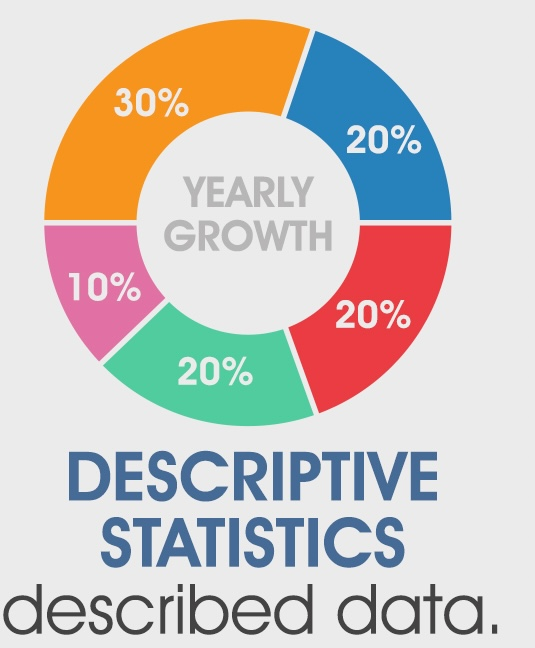
:::

::: {.column width="50%"}
-   Enkla, lättlästa, sammanfattningar om `stickprovet`, utan att
    förlora viktig information.
-   Tillsammans med enkla `grafer` och `tabeller` utgör de grunden för
    praktiskt taget varje kvantitativ analys av data.
-   Beskrivande statistik innebär att man **inte generaliserar utanför
    urvalet**
-   [Data-ink-ratio](https://www.performancemagazine.org/data-ink-ratio-minimalism-data-visualization/)
-   [Edward Tufte](https://www.edwardtufte.com/)
-   [Nightingale](https://nightingaledvs.com/)
:::
:::

::: notes
Beskrivande statistik handlar om att beskriva/sammanfatta den insamlade
datan

Det kan vara numerisk (siffror i tabell) och/eller grafisk (histogram,
boxplott, stapeldiagram)

OBS: Inferentiell statistik handlar om att dra slutsatser från den
insamlade datan
:::

## Kategoriska data

Kvalitativa/kategoriska variabler, *(t.ex: Kön eller Rökstatus)*

-   Stapeldiagram och frekvenstabeller med:
-   `Antal` (antal obs. i varje kategori) och
-   `Andel` (andel obs. i varje kategori)

::: notes
Beskrivande statistik handlar om att beskriva/sammanfatta den insamlade
datan

Numerisk beskrivande statistik beskriver data med hjälp av siffror i
tabeller Grafisk beskrivande statistik beskriver data med hjälp av
diagram, t.ex. histogram, boxplott etc.

Kategoriska variabler Frekvenstabeller (frekvens och proportioner) och
stapeldiagram
:::

## Punktskattning

-   Populationsmedelvärde: $\mu$
-   Medelvärdesskattning: $\bar x = \frac{1}{N}\sum_{i = 1}^N x_i$
-   T ex: $\bar x = 174$ cm → 174 är vår punktskattning av $\mu$.
-   Denna skattning är dock urvalsspecifik, dvs. om du gör ett nytt
    experiment får du en ny skattning.
-   Det finns `osäkerhet` i skattningen av $\bar x$

> A distinctive function of statistics is this: it enables the scientist
> to make a numerical evaluation of the `uncertainty` of his conclusion.
>
> --- George W. Snedecor

{style="filter: invert(1)"}

::: notes
THE STATISTICAL PART OF THE SCIENTIFIC METHOD George W. Snedecor First
published: March 1950 https://doi.org/10.1111/j.1749-6632.1950.tb53972.x
:::

## Spridning/variation

-   Hur mycket avviker de individuella mätningarna från medelvärdet?
-   Kan beskrivas i termer av min-max, IQR etc
-   Ett vanligt mått för variation är `varians`
-   För populationen: $\sigma^2$
-   För stickprovet: $s^2 = \frac{1}{N-1}\sum(x_i - \bar x)^2$
-   `Standardavvikelse`: $\sigma = \sqrt{\sigma^2}$
-   Skattas som
    $s = \sqrt{s^2} = \sqrt{\frac{1}{N-1}\sum(x_i - \bar x)^2}$
-   Där $N =$ stickprovsstorleken

## Symmetrisk numeriska data

-   `Centralitetsmått:` Räcker med medel ($\bar x$) eller median
-   `Spridning:` Standardavvikelse ($s$)

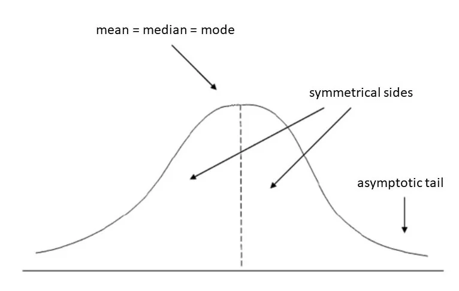

## Skev numeriska data

-   **Centralitetsmått:** `Median`
-   **Spridning:** minimum-maximum (range) eller interkvartilavstånd
    (`IQR`) (kvartil 3 -- kvartil 1)

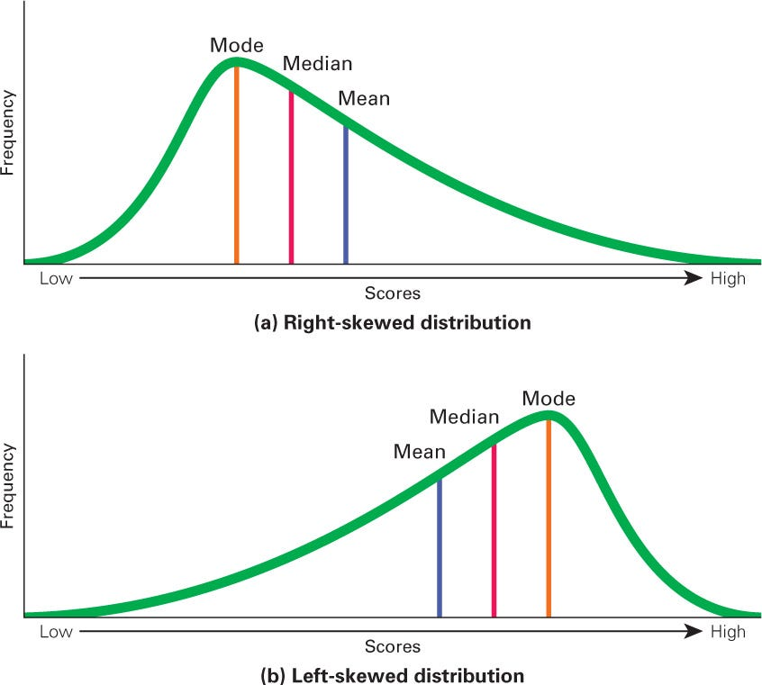

::: notes
Beskrivande statistik handlar om att beskriva/sammanfatta den insamlade
datan

Numerisk beskrivande statistik beskriver data med hjälp av siffror i
tabeller Grafisk beskrivande statistik beskriver data med hjälp av
diagram, t.ex. histogram, boxplott etc.

Kontinuerliga variabler Parametriska metoder\
Central tendens (läge) = Medelvärde, Spridning: (spännvidd) = Hur
spridda värdena är från "centrum" = Standardavvikelse\
95% konfidensintervall Histogram för att kontrollera normalfördelning av
data

Icke-parametriska metoder Central tendens (läge) = Median\
Spridning: (spännvidd) = Hur spridda värdena är från "centrum" = 2:a och
3:e kvartil eller interkvartilavstånd  Boxplot   
:::

##  {background-image="img/EB_V24_116.png" background-size="contain" fig-alt="The mediating role of recovery opportunities on future sickness absence from a gender- and age-sensitive perspective J. S. Boschman et al. (2017)"}

::: notes
Medelvärde och standardavvikelse för den kontinuerliga variabeln ÅLDER

Frekvenstabeller med frekvens och proportioner för varje kategori av den
kvalitativa variabeln CIVILSTÅND
:::

##  {background-image="img/EB_V24_119.png" background-size="contain" fig-alt="Nerve conduction in relation to vibration exposure - a non-positive cohort study. Helena Sandén et al. (2010)"}

::: notes
En boxplot som beskriver median, första kvartil och tredje kvartil av

Sensorisk nervledning

sensoriska latenser i höger hand mellan oexponerade (0) och exponerade
(1-4 klasser med kumulativ livstids exponering) försökspersoner
:::


# Inferens

Statistisk slutledning

##  {background-image="img/EB_V24_121.gif" background-size="contain"}

## Statistisk inferens

-   Statistisk inferens är att dra `slutsatser` om urvalets
    **populationsbaserade** egenskaper.
-   Det finns två typer av statistiska slutsatser:
    -   Skattning/estimering (`konfidensintervall`; CI)
    -   `Hypotesprövning` (med hjälp av ett `test`/CI)

## Osäkerhet

-   Det går även att skatta hur bra ett estimat är

-   Dvs, hur mycket avviker `estimatet` från `parametern`?

-   Detta kallas `standardfel` (standard error; SE)

-   Standardfel för medelvärdet: $SE(\bar x) = \frac{s}{\sqrt{n}}$

-   Med mer data (större $n$) får vi ett mindre fel, dvs en säkrare
    `skattning`

- Vi bryr oss inte om relationen mellan $n$ och den totala populationsstorleken (ibland $N$)

------------------------------------------------------------------------

```{r}
# Ladda nödvändiga paket
library(ggplot2)

# Definiera stickprovsstorlekar och olika standardavvikelser
n_values <- seq(10, 1000, by = 10) # Stickprovsstorlekar
sigma_values <- c(5, 10, 20) # Olika standardavvikelser

# Skapa en data.frame för ggplot
data <- do.call(
  rbind,
  lapply(sigma_values, function(sigma) {
    data.frame(
      SampleSize = n_values,
      StandardError = sigma / sqrt(n_values),
      SD = paste("SD =", sigma) # Lägg till en etikett för SD
    )
  })
)

# Skapa ggplot med olika kurvor för varje SD
ggplot(data, aes(x = SampleSize, y = StandardError, color = SD)) +
  geom_line(size = 1) +
  labs(
    title = "Standardfel minskar med ökande stickprovsstorlek",
    x = "Stickprovsstorlek (n)",
    y = "Standardfel (SE)",
    color = "Standardavvikelse"
  ) +
  theme_minimal(base_size = 14) +
  theme(legend.position = "top")
```

## Konfidensintervall (CI)

-   Ett intervall som med en viss `säkerhet` ($\neq$ sannolikhet) täcker
    det sanna parametervärdet.
-   Ges för $\mu$ av $\bar x \pm k \cdot SE$ eller
    $(\bar x - k \cdot SE; \bar x + k \cdot SE)$
-   där $k$ är en konstant som beror på den önskade felmarginalen
-   `felmarginal` (margin of error): halva bredden av CI
-   t ex: För `95 % CI` är ofta[^1]
    $k = 1.96 \Rightarrow \bar x \pm 1,96 \cdot SE$
-   T ex: Vi har $\bar x = 174$ cm och vi är 95 % säkra på att $\mu$
    ligger mellan 166 och 182 cm.
-   Vi kan med 95 % säkerhet säga att den verkliga medellängden för
    läkarstudenterna är mellan 166 och 182 cm.
-   Varför just 95 %?

[^1]: Om t ex centrala gränsvärdessatsen tillämpas (se senare)

::: callout-note
## Andra intervall

-   Referensintervall (utgår från stickprovet)
-   Prediktionsintervall (utgår från en modell)
:::

## Hypotesprövning

-   Tanken är att vi har en fråga om populationen som vi vill försöka
    besvara med ett statistiskt `test`.
-   Ett krav för alla statistiska tester är att formulera en
    `nollhypotes` ($H_0$) och en `alternativhypotes` ($H_1$ eller
    $H_A$).

::: notes
Du börjar med att formulera en nollhypotes (H0). Du vill kunna förkasta
H0, t.ex. ingen effekt/ingen skillnad mellan grupper. Om H0 förkastas,
ska endast den alternativa hypotesen (H1) kvarstå. H0: Ingen effekt H1:
En effekt Det vill säga, H0 och H1 bör formuleras så att om en är falsk
måste den andra vara sann.
:::

## Hypoteser

-   $H_0$ är ofta försiktigt formulerad: kan aldrig bevisas; anses vara
    sann till dess motsatsen verkar mycket mer trolig
-   $H_1$ inkluderar allt utom $H_0$
-   Du bestämmer en `signifikansnivå`, ofta 5 % ($\alpha = 0.05$)
-   Testa hypotesen med hjälp av ett statistiskt test, vilket resulterar
    i ett $p$-värde.
-   $p$-värdet = sannolikheten för ett utfall minst lika "extremt" som
    det observerade stickprovet, givet att $H_0$ är sann
-   $p < \alpha$ talar då för at $H_0$ **inte** är sann.
-   $\Rightarrow H_0$ förkastas (rejects).
-   $p > \alpha$ betyder att vi saknar tillräckligt underlag för att
    förkasta $H_0$ (mer om det senare).

::: notes
En hypotes är ett påstående om populationen som antingen kan vara sant
eller falskt. Nollhypotesen (H0): Ansågs vara sann tills den motbevisas
Kan aldrig bevisas Ofta försiktigt formulerad Den alternativa hypotesen
(H1): Inkluderar allt utom nollhypotesen Är med andra ord ganska vagt
formulerad

Signifikansnivån (α) bör väljas innan några analyser görs. Den
specificerar den högsta acceptabla risken för att felaktigt förkasta H0
(det vill säga göra ett typ 1-fel). Till exempel är signifikansnivån för
ett 95% konfidensintervall 0,05 (1-0,95) eller 5%. Vi accepterar att 5%
av våra konfidensintervall inte kommer att täcka det sanna värdet,
vilket kan leda oss till en felaktig slutsats.
:::

## Exempel: Hypoteser

-   `En grupp`: Medelåldern här inne är 30 år?
-   $H_0: \mu = 30; H_1: \mu \neq 30$
-   `Två grupper`: Män och kvinnor är lika gamla?
    -   $H_0: \mu_1 = \mu_2; H_1: \mu_1 \neq \mu_2$
-   `Parade mätningar`: Skostorleken på höger och vänster fot är samma?
    -   $H_0: \Delta = 0; H_1: \Delta \neq 0$
-   `Flera grupper`: Lika långa oberoende av bänkrad?
    -   $H_0: \mu_1 = \mu_2 = \ldots = \mu_k; H_1: \mu_i \neq \mu_j$ för
        något $i \neq j$.
    -   Hur vet man vilka grupper som i så fall skiljer sig? Post-hoc
        test!

::: callout-note
-   Tester kan även avse andra parametrar än medelvärde!
-   Ibland används tester intermediärt för att utvärdera om en viss
    metod är lämplig (preliminary testing/assumption testing).
:::

## Parade mätningar

-   Vanligtvis tre situationer som ger upphov till parade observationer:
-   Mätningar som görs på `samma individ` vid olika tidpunkter, t.ex.
    före och efter behandling
-   Matchade `fall-kontrollstudier`, för varje behandlad patient hittar
    vi en icke-behandlad person med liknande observerbara egenskaper,
    för att bedöma behandlingseffekten
-   I dessa fall finns `beroende` mellan observationerna i de olika
    grupperna.
-   Par om 2? Går ofta att utgå från `differenser`:
    $\delta_i = x_{i2} - x_{i1}$

##  {background-image="img/EB_V24_132.jpg" background-size="contain"}

## Test

-   `Typ` av data (kvantitativ/kvalitativ) + `fördelning` avgör
-   `Parametriska`: utfallsvariabeln är t.ex normalfördelad; medelvärde
    ($\mu$) och standardavvikelse ($\sigma$) är parametrar.
    -   Du testar antaganden om parametrarna på populationsnivå (t.ex.
        $H_0: \mu = 0$; $H_1: \mu \neq 0$).
-   `Icke-parametriska`: du vet **inte** (kan inte anta) någon
    fördelning för variabeln:
    -   Du testar antaganden om populationen oberoende av någon
        fördelning (t.ex. medianen eller hela fördelningen)

::: notes
När du har formulerat dina hypoteser kanske du vill testa dem.

Valet av statistiskt test beror på typen av variabel (kvantitativ,
kvalitativ) och fördelningen av variabeln. Parametriska tester:
variabeln är t.ex. normalfördelad; medelvärde och standardavvikelse är
parametrar. Du testar antaganden om parametrarna på populationsnivå
(t.ex. medelvärde). Icke-parametriska tester: du vet inte (kan inte
anta) någon fördelning för variabeln. Du testar antaganden om
populationen oberoende av någon fördelning (t.ex. median).
:::

## Antaganden

-   Alla statistiska test har `antaganden` (assumptions/conditions). T
    ex:
-   Typ av variabel (binära/kategoriska/kontinuerliga)
-   `Beroenden` mellan observationer.
    -   Parade (beroende) data
    -   Oberoende data
-   T ex: Mann-Whitney U test kräver oberoende grupper
- Några antaganden kan undersökas grafiskt eller mha test
- Några blir mer spekulativa (är enheterna verkligen oberoende?)
- Rent tekniskt/matematisk kan många test utföras ändå men tolkningen riskerar bli fel!

::: notes
The non-parametric tests also have assumptions. E.g. Mann-Whitney U test
is for two independent groups Chi-square test can only be used for
categorical data
:::

## Fel

| Vårt beslut         | $H_0$ sann              | $H_1$ sann              |
|---------------------|-------------------------|-------------------------|
| Förkasta inte $H_0$ | ✅ ($1-\alpha$)         | ❌ Typ II-fel ($\beta$) |
| Förkasta $H_0$      | ❌ Typ I-fel ($\alpha$) | ✅ (styrka; $1-\beta$)  |

-   ❌ Typ 1-fel: Sannolikheten ($\alpha$) att förkasta $H_0$ när $H_0$
    är sann. "Falskt positivt"
-   ❌ Typ 2-fel: Sannolikheten ($\beta$) att **inte** förkasta $H_0$
    när $H_0$ är falsk. "Falskt negativt"
-   ✅ Styrkan (power) av ett test ($1-\beta$) är sannolikheten att
    förkasta $H_0$ när $H_0$ är falskt.

::: notes
Förkasta nollhypotesen Potentiell typ I-fel: förkastande av sann H0 Vi
tror att det finns en effekt av behandlingen, när det i verkligheten
inte finns. Misslyckas med att förkasta nollhypotesen Potentiell typ
II-fel: inte förkastande av falsk H0 Vi tror att det inte finns någon
effekt av behandlingen, när det i verkligheten finns.

Styrka = Sannolikheten att förkasta H0 när den är falsk och är lika med
(1-β). Vi har högre tolerans för typ II-fel, eftersom vi i detta fall
drar slutsatsen att det inte finns några skillnader i terapi/operation
osv., även om det i verkligheten finns skillnader. En enkel konsekvens
blir att inte genomföra terapin.

Å andra sidan har vi en lägre tröskel för typ I-fel, varför?
:::

## Fördelning

-   Eng: `distribution`
-   **Populationens fördelning**
-   **Stickprovsfördelning**
    -   Den enda observerbara.
    -   Ju större urval desto närmare populationsfördelningen
-   **Stickprovsstatistikans fördelning**
    -   Exempel: medelvärdet har en `normalfördelning` för en
        normalfördelad variabel eller ett tillräckligt stort urval

::: {layout-ncol="4" height="200"}
{style="filter: invert(1)"}

{style="filter: invert(1)"}

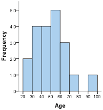

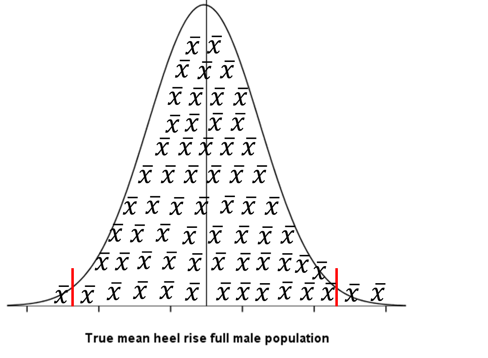

:::

--------------------------------------------------------------------

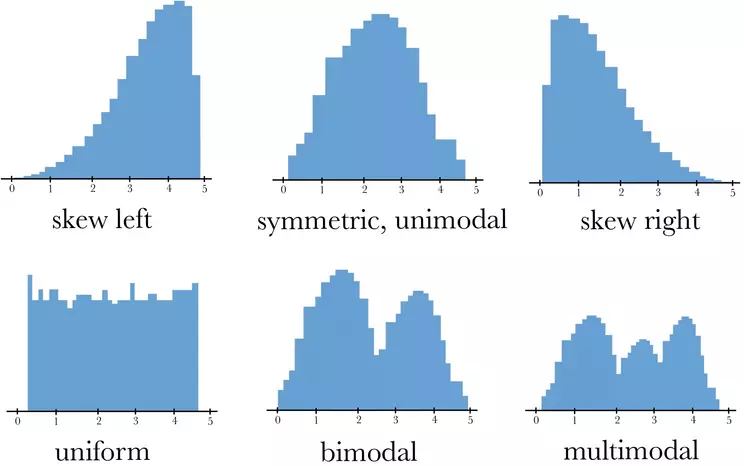

::: notes
En stickprovsfördelning är frekvensfördelningen av stickprovsstatistik.
Standardfelet för medelvärdet är standardavvikelsen för
stickprovsmedelvärden. Det är ett mått på hur representativt ett
stickprovsmedelvärde förväntas vara för populationsmedelvärdet.
:::

## Normalfördelningen

-   En väldigt vanlig fördelning för kvantitativa data
-   `Symmetrisk` (medelvärde = median = typvärde)
-   `Parametriseras` med medelvärde $\mu$ och varians $\sigma^2$
-   Betecknas ofta: $N(\mu, \sigma^2)$ eller $N(\mu, \sigma)$
    -   T ex: $IQ \sim N(\mu = 100, \sigma = 15)$
-   Används ofta i standardiserad form $N(0,1)$
-   Från denna fördelning är
    -   2,5 % av värderna $\leq -1.96$
    -   2,5 % av värderna $\geq 1.96$
-   `1.96` är därför en vanlig konstant ($1.96 = z_{\alpha/2} = k$) för
    konfidensintervall och test

## Fler fördelningar

-   Binomialfördelning (binär data)
-   $t$-fördelning ("normalfördelning med tjocka svansar")
-   $\chi^2$-fördelning (korstabeller)
-   Poisson-fördelning (antalsdata)
-   $F$, Weibull, Gompertz, Beta, Gamma, ...

::: notes
Which is the correct statistical test to use? By Evie McCrum-Gardner
British Journal of Oral and Maxillofacial Surgery 46 (2008) 38--41
:::

## Centrala gränsvärdessatsen



-   `Medelvärdet` av ett `tillräckligt stort` stickprov av kvantitativa
    data kommer att vara `normalfördelat`, **oberoende av urvalets
    fördelning**.
-   (Helt) sant om $N \rightarrow \infty$
-   Stämmer ganska bra även för relativt små stickprov, om fördelningen
    är någorlunda symmetrisk.
-   Dra nytta av detta när du testar och konstruerar konfidensintervall!

::: notes
Centrala gränsvärdessatsen säger att om vi upprepade gånger tar oändligt
stora stickprov från en population kommer medelvärdena av dessa ALLTID
vara normalfördelade, oavsett hur variabelns fördelning ser ut. Eftersom
vi sällan har oändligt stora stickprov så kan vi vara glada över att
detta gäller approximativt långt innan -- redan vid ett stickprov på
30-50 börjar det blir rimligt att anta normalfördelning förutsatt att
variabelns fördelning inte är väldigt långt från normalfördelningen. I
exemplet med syreupptagningsförmågan hade vi ett stickprov på 397
individer -- det betyder att vår statistiska modell är rimlig om inte
syreupptagningsförmåga hade en väldigt skev fördelning. Var gränsen går
i balansen mellan hur 'normalfördelat' ett stickprov behöver vara och
hur stor stickprovsstorlek som behövs för att tillämpa centrala
gränsvärdessatsen går inte att säga rakt av. När man skall avgöra detta
är det alltid bra att rita upp ett histogram på materialet oavsett hur
stort stickprov man har -- om inte annat än för att det finns andra fel
(felaktigt inmatade data ex) man kan upptäcka. Om undersökningen är
mycket liten, n\<20 så krävs det att man på förhand känner till att
variabeln man är intresserad av är normalfördelad. Vid 20-50 brukar det
normalt sett gå att använda normalfördelningen om data bara är
någorlunda symmetrisk. Om data har en sned fördelning kan större
stickprovsstorlekar behövas, se senare exempel. Man kan också överväga
att transformera skeva data så att de blir mer symmetriska innan
analysen.
:::

## Exempel

Jämför den maximala syreupptagningsförmågan (VO2 max) för personer med
löpning ($n = 25$) eller promenader ($n = 21$) som primär träningsform

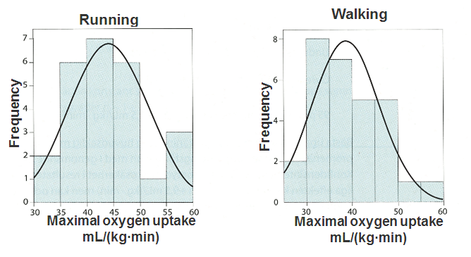

::: notes
maximal oxygen uptake (VO2 max) is a quantitative (continous) variable.
Draw a histogram. Are histograms aproximately symmetric?
:::

## Exempel

- Testa om medelvärden skiljer sig

-   Normalfördelad data/tillräckligt stort stickprov?

-   Låt $\mu_1 =$ genomsnittlig maximal syreupptagningsförmåga bland
    **löpare**

-   och $\mu_2 =$ genomsnittlig maximal syreupptagningsförmåga bland
    **gångare**

-   $H_0: \mu_1 = \mu_2$

-   $H_1: \mu_1 \neq \mu_2$

-   Låt signifikansnivån vara 5 %: $\alpha = 0.05$

-   Parametriskt test med två oberoende grupper.

- Oberoende variabel ($X$) = motionsform (gå/springa), beroende variabel ($Y$) = syreupptagningsförmåga 

## 

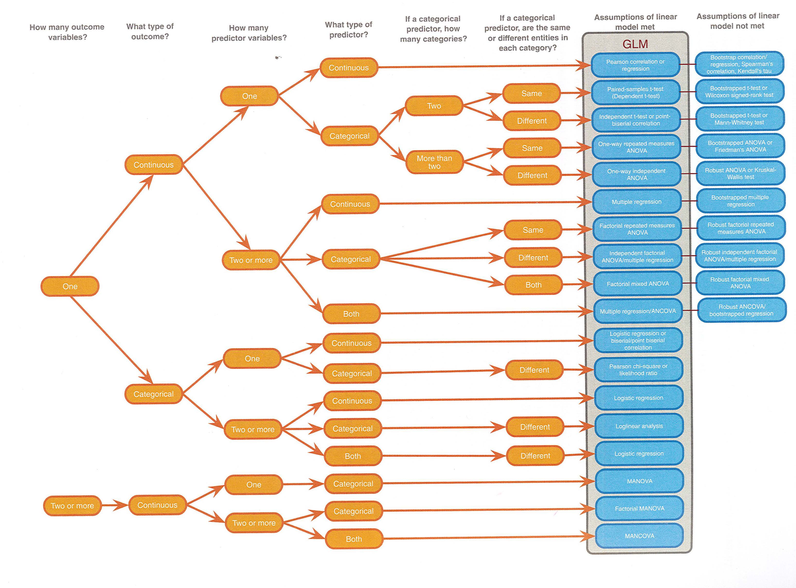

::: notes
Discovering Statistics Using IBM SPSS Statistics by Andy Field 5th
Edition ISBN-13:978-1-5264-1952-1

Detta är en guide för att välja vilket statistiskt test som ska användas
för att besvara en specifik forskningsfråga.

Discovering Statistics Using IBM SPSS Statistics 5th Edition page: 1072
ISBN-13:978-1-5264-1952-1

Hur man väljer rätt statistiskt test för ett forskningsprojekt, klinisk
studie eller annan undersökning. Det första steget är att bestämma
vilken mätskala dina data har, eftersom detta kommer att påverka ditt
beslut - nominal, ordinal eller intervall. Nästa steg är att överväga
syftet med analysen - till exempel, jämför du oberoende eller parvisa
grupper?

Om ett felaktigt test används kan ogiltiga resultat och vilseledande
slutsatser dras från studien. Mätskala; Parametrisk antagande; Parvis
eller oberoende data;
:::

# p-värden

## Nollhypotes och P-värde

-   P-värden visar hur väl data stöder en nollhypotes.
-   Inte tvärtom!
-   Ingen nollhypotes =\> inget p-värde!
-   Det kan ses som svaret på frågan:
    -   Hur väl stöder mina data nollhypotesen?
      - Bara relevant om data representativ för populationen
-   Om vi inte känner till nollhypotesen (frågan) blir p-värdet (svaret)
    meningslöst.

## Tolkning av p-värden

-   Sannolikheten att dra ett minst lika extremt urval som det vi har,
    givet $H_0$.
-   Med andra ord, sannolikheten för att observera minst den observerade
    skillnaden från $H_0$, givet att $H_0$ är sann.
-   P-värdet säger ingenting om sannolikheten för att $H_0$ är sann!
-   Det mäter inte heller stödet för den alternativa hypotesen $H_1$!

::: notes
En test av nollhypotesen resulterar i ett p-värde. Definitionen för
p-värde vid testning av en hypotes om mu: Sannolikheten att observera
värdet x som vi observerade, eller ett ännu mer extremt värde, givet att
H0 är sann. P-värdet (p) är ett mått på styrkan i bevisen i de
observerade datan mot H0. P är en sannolikhet -\> 0 \< p \< 1. Den
grundläggande idén är att om p är lägre än signifikansnivån så förkastar
du nollhypotesen. P-värdet kallas då signifikant.
:::

## 

::: callout-important
## Viktigt!

-   Alla statistiska test kräver antaganden!
-   Egenskaper/påståenden som antas vara sanna och som DU behöver
    kontrollera!
-   Ett p-värde (eller CI) är giltigt (korrekt) om och endast om
    antagandena är sanna!
-   Om antagandena inte håller finns det en risk att p-värdet är
    nonsens!
:::

## $p \geq\alpha$

-   Att ett p-värde är större än signifikansnivån innebär att resultaten
    inte är “statistiskt signifikant”.
-   Så ett icke-signifikant test av medelvärden innebär att det inte
    finns någon skillnad mellan grupperna?
-   Nej, det är inte vad vi säger!
-   Det betyder bara att vi inte kan se en statistiskt signifikant
    skillnad.
    -   Det kan vara så att vi har för låg styrka ($1-\beta$) för att
        upptäcka det.

::: notes
Signifikansnivån (α) bör väljas innan några analyser utförs. Den
specificerar den högsta acceptabla risken för att felaktigt förkasta H0
(det vill säga göra ett typ 1-fel). Till exempel är signifikansnivån för
ett 95% konfidensintervall 0,05 (1 - 0,95) eller 5%. Vi accepterar att
5% av våra konfidensintervall inte kommer att täcka det sanna värdet,
vilket kan leda oss till en felaktig slutsats.
:::

# Stickprovsstorlek

## Relevans?

-   Om vi på förhand kan styra hur många studieobjekt som inkluderas
    -   Hur många möss behöver vi offra?
    -   Hur många enkäter behöver vi skicka ut?
    -   Är det någon idé att journalgranska om vi inte har fler än max
        100 journaler?
-   INTE relevant för att i efterhand bortförklara varför vi inte
    uppnådde statistisk signifikans!
-   Behövs sällan vid t ex registerstudier

## Stickprovsstorlek

-   Grupperna är för små (för litet stickprov):
    -   $H_0$ förkastas inte, även om en relevant skillnad finns (typ
        I-fel).
    -   Resultaten kan inte användas för att säga att det finns någon
        skillnad.
-   Grupperna är för stora:
    -   Slöseri med resurser.
    -   Studien kan visa skillnader som inte har någon praktisk
        betydelse, kliniskt irrelevant.
    -   Risk för lägre datakvalitet på grund av stor organisation?

## Styrka

-   Du har en hypotes ($H_1$): det finns en skillnad i blodtryck mellan
    överviktiga och normalviktiga.
-   Vad krävs för att förkasta $H_0$ (ingen skillnad)?
-   Vad man inte vill, är att det ska sluta med en kostsam, för
    patienterna riskfylld, tidskrävande studie som inte fann något
    intressant resultat.

## Antalsberäkning

för jämförelse av medelvärden

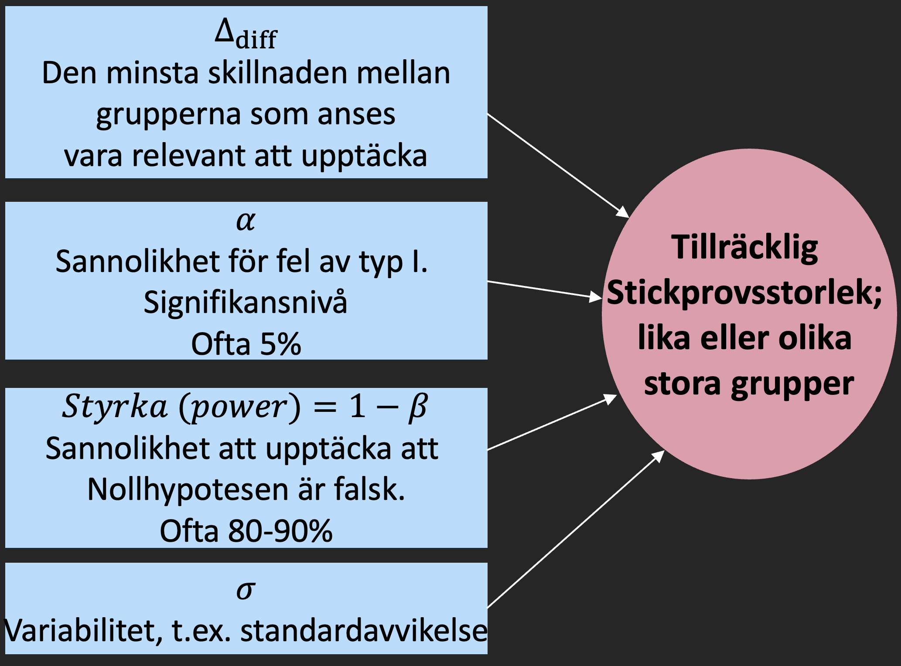

## Exempel: medelvärde

-   Vi vill studera normalviktiga unga vuxna,
    -   grupp 1 normalviktiga som barn,
    -   grupp 2 överviktiga som barn
-   Fråga: samvarierar vikten som barn med blodtrycket som vuxen?
-   Hypotes: $H_0: \mu_1 = \mu_2; H_1: \mu_1 \neq \mu_2$
-   Hur många studiedeltagare behövs?
-   Du måste göra antaganden om den minsta skillnad du vill kunna hitta
    samt variabiliteten.\
-   Kliniskt relevant skillnad = 10 mmHg diastolisk: $\Delta = 10$
-   Varians i population: $\sigma^2 = 10$
    -   Vi antar att det är samma i båda grupperna
-   Bestäm signifikansnivå $\alpha = 0.05 \Rightarrow k_1 = 1.96$
-   styrka $1-\beta = 0.8 \Rightarrow k_2 = 0.84$
-   $n \geq 2 \sigma^2 \cdot \left( \frac{k_1+k_2}{\Delta}\right)^2 = 2 \cdot 10 \cdot \left( \frac{1.96 + 0.84}{10}\right)^2 = 1.568$
-   Minsta urvalsstorlek är 2 per grupp =\> 4 totalt

::: fragment

| $\alpha$ | k1   | $1- \beta$ (power) | k2   |
|----------|------|--------------------|------|
| 0.001    | 3.29 | 0.8                | 0.84 |
| 0.01     | 2.58 | 0.9                | 1.28 |
| 0.05     | 1.96 | 0.95               | 1.96 |
|          |      | 0.99               | 2.33 |

:::

## 

-   Detta betyder att skillnaden i medelvärde måste vara minst 10 mellan
    grupperna för att vi ska kunna förkasta $H_0$ med $n = 4$
-   Är den faktiska skillnaden mindre så krävs ett större stickprov
-   Anta $\Delta = 5$
-   $n \geq 2 \sigma^2 \cdot \left( \frac{k_1+k_2}{\Delta}\right)^2 = 2 \cdot 10 \cdot \left( \frac{1.96 + 0.84}{5}\right)^2 = 6,272$
-   krävs 7 per grupp (avrunda alltid uppåt!), dvs 14 totalt.

## Exempel: Andel

-   Studentkåren vill skatta andelen missnöjda studenter vid Sahlgrenska
    akademin.
-   Vill att ett 95 % konfidensintervall ska ha en bredd på 12
    procentenheter.
    -   en felmarginal (margin of error): $m = 0.06$
-   Anta 25 % är missnöjda: $p = 0.25$
-   $n = p(1-p) / SE^2(p)$
-   där $SE(p) = m/k_1 = 0.06/1.96 \approx 0.031$
-   $n = 0.25 (0.75)/0.031^2 \approx 200$
-   Vad betyder det?
    -   Fråga 200 studenter?
    -   Samla in 200 svar?

## Exempel: Olika andelar

-   Vi är intresserade av andelen som återgår till arbete bland
    canceröverlevare.
-   Två grupper, Grupp 1 vs Grupp 2 med andelar $p_1$ resp $p_2$
-   $H_0: p_1 = p_2; H_1: p_1 \neq p_2$
-   $\alpha = .05$
-   $1-\beta = .8$ (power)
-   Hur stort stickprov behövs för att detektera att andelen i grupp 1
    är 60 % jmfrt med 40 % I grupp 2?

## SPSS

::: {layout-ncol="2"}
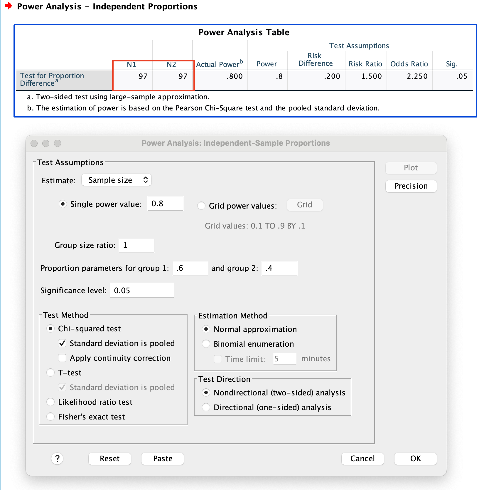

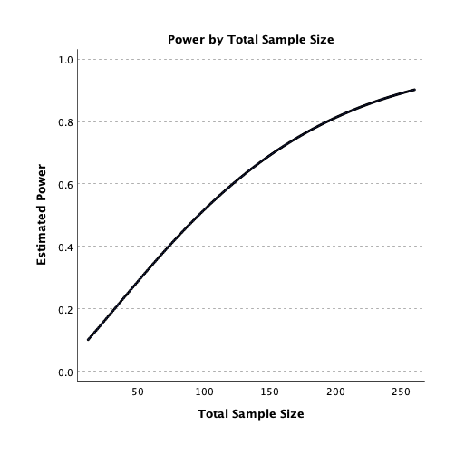
:::

Finns även flera på nätet, t ex
[OpenEPI](http://www.openepi.com/Menu/OE_Menu.htm)

# Multipla test

##  {background-image="img/image14.png" background-size="contain"}

##  {background-image="img/image16.png" background-size="contain"}

##  {background-image="img/image17.png" background-size="contain"}

## Multipla tester

-   Ett hypotestest med en signifikansnivå på 5 % har en risk på 5 % för
    ett falskt positivt resultat (typ I-fel).
-   För två parallella test: $1−(1−0.05)^2=0.0975$
-   Om $c$ oberoende tester utförs ges en kombinerad risk för minst ett
    falskt positivt test (“family-wise error rate”; FWER)
    -   $\bar \alpha = 1 - (1-\alpha)^c$
-   Bonferroni-korrektion: Skala om signifikansnivån:
    -   $\alpha_{new} = \alpha_{old} / c$
    -   eller skala om $p$-värdet: $p_{new} = \min(p_{old} \cdot c, 1)$
    -   konservativt
-   Bonferroni-Holm bättre
-   Šidák: $\alpha_{new} = 1 - (1-\alpha_{old})^{1/c}$

## 

```{r, echo = FALSE}
c <- 1:50
x <- 1 - (1 - 0.05)^c
plot(c, x, xlab = "Antal test", ylab = "Sannolikhet för minst ett typ I-fel.")
```

##  {background-image="images/paste-19.png" background-size="contain"}

# Vanliga test

##  {background-image="img/EB_V24_126.png" background-size="contain"}

##  {background-image="img/test.png" background-size="contain"}

## Jämförelse av medelvärden

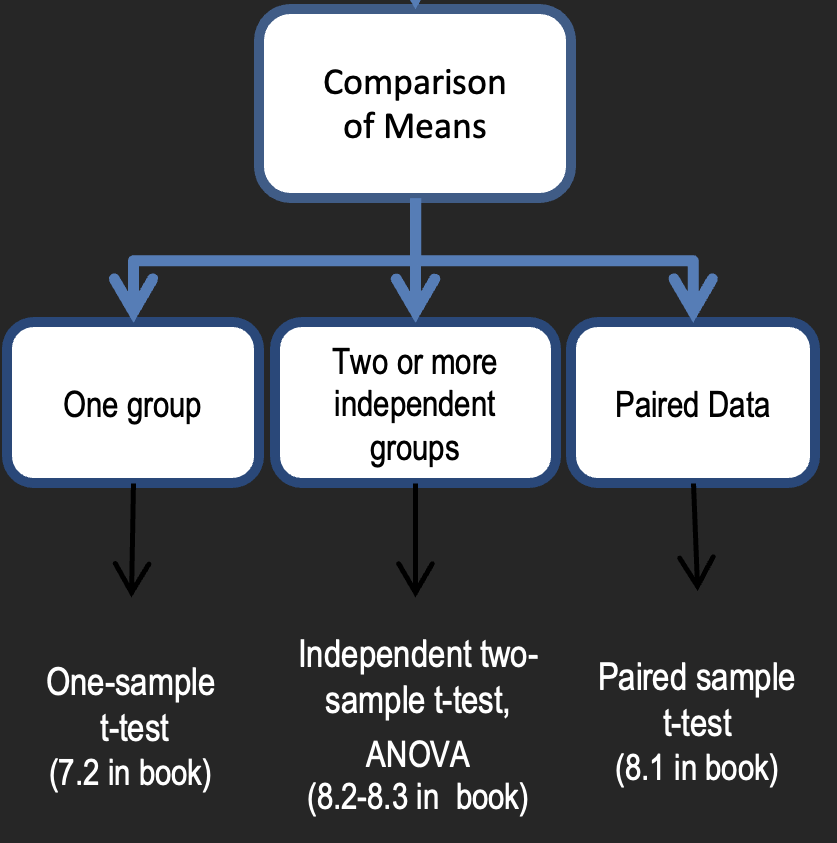

## Exempel

::: columns
::: {.column width="60%"}
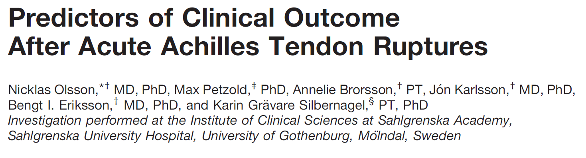
:::

::: {.column width="40%"}
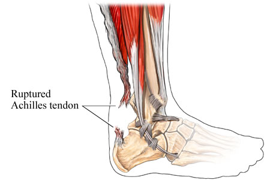{height="150px"}
:::
:::

Syfte

:   Undersöka symtomatiska och funktionella utfall efter akut
    hälseneskada.

Data

:   79 män + 14 kvinnor vid 3, 6 och 12 månader.

Utfall

:   Total Rupture Score (ATRS) för symtom + maximal hälhöjning (LSI) för
    funktion.

Prediktorer

:   Behandling, ålder, BMI, fysisk aktivitet, hälhöjning vid 6 mån, ATRS
    vid 3 mån.

::: notes
https://doi.org/10.1177/0363546514527409
:::

## 

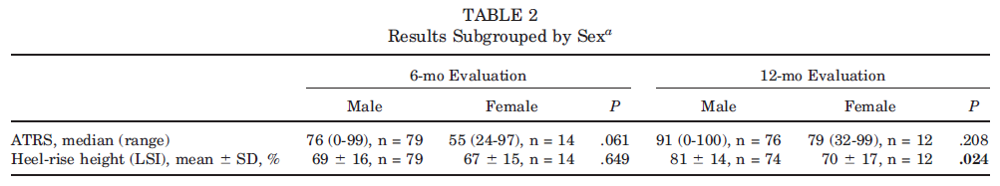

-   Vad betyder $p=0.649$?
-   $H_0$: Ingen skillnad i genomsnittlig maximal hälhöjning (LSI)
    mellan män och kvinnor efter 6 månader vs.
-   $H_1$ : Skillnad i genomsnittlig maximal hälhöjning (LSI) mellan män
    och kvinnor efter 6 månader
-   Vilket test bygger det på?

## t-test

-   $t$-tester är en familj av tester för medelvärden

    -   En grupp (one sample t-test)
    -   Två oberoende grupper (two samples independent t-test)
    -   Parade mätningar (paired t-test)
        -   = en grupp av differenser

-   Vanliga antaganden:

    -   Kvantitativ variabel
    -   Fördelningen av stickprovsmedelvärdet är approximativt normal:

    a.  den är normalfördelad redan i stickprovet
    b.  eller vi vet från andra sammanhang att den är normalfördelad
    c.  eller så är urvalsstorleken "tillräckligt stor"(?). Centrala
        gränsvärdessatsen!

## Vad är "tillräckligt stor"?

Tumregel från Björk:

$n < 20$

:   $t$-test bör endast användas om variabeln är känd för att vara
    normalfördelad (t.ex. från tidigare större studier)

$n \in (21, 50)$

:   $t$-test kan användas om data är ungefär normalfördelade

$n > 50$

:   $t$-test kan användas (med få extrema undantag)

## ANOVA

-   Vad händer om vi har mätningar från $k > 2$ grupper?
-   ANalysis Of VAriance (ANOVA)
    -   Oberoende stickprov $\Rightarrow$ oberoende ANOVA
    -   Parade data $\Rightarrow$ parad ANOVA
-   $H_0: \mu_1 = \mu_2 = \ldots = \mu_k; H_1: \mu_i \neq \mu_j$ för
    något $i \neq j$
-   Antaganden:
    -   Värderna i en given grupp är oberoende och normalfördelade
    -   Grupperna är oberoende av varandra
    -   Lika variation i alla grupper
        ($\sigma_1^2 = \sigma_2^2 = \ldots = \sigma_k^2$)
    -   Normalfördelade resiudualer (= skillnad mellan enskilt värde och
        gruppens medelvärde)

## 

{style="filter: invert(1)"}

{style="filter: invert(1)"}

$F = 15,43 \Rightarrow p < 0.0001$

::: notes
Mellan grupper df = antal grupper - 1 Inom grupper df = antal
observationer - antal grupper Totalt df = antal observationer - 1

Fp, (k-1), (n-k) = F-fördelning med (k-1) (i nämnaren) och (n-k) (i
täljaren) frihetsgrader k = antal grupper n = totalt antal observationer

Frihetsgrader för mellan = antal grupper - 1 Frihetsgrader för inom =
antal observationer - antal grupper Frihetsgrader för totalt = antal
observationer - 1
:::

## Icke-parametriska test

Vad händer om:

-   jag har en skev fördelning?
-   antagandena för parametriska tester inte är uppfyllda?
-   variabeln inte är kontinuerlig, utan ett ordningstal?
-   **ICKE-PARAMETRISKA TEST!**

## Några icke-parametriska test

2 oberoende grupper

:   **Mann-Whitney U-test**

    (=Mann–Whitney–Wilcoxon (MWW/MWU), Wilcoxon rank-sum test,
    or Wilcoxon–Mann–Whitney test)

    -   T ex: Fysiskt aktiva vs Fysiskt icke-aktiva personer

    -   Du behöver inte ha samma antal observationer i båda grupperna!

Parade observationer

:   **tecken-test** (Sign-test)

:   **Wilcoxon signed-rank test**

:   Kräver observationer från varje medlem i paret (före---efter)

Fler oberoende grupper

:   **Kruskal-Wallis** test

:   (parameterfritt alternativ till ANOVA)

Fler grupper med parade mätningar

:   **Friedmans test**

##  {background-image="img/image65.jpg" background-size="contain"}

## Exempel: njurfunktion

-   Två metoder för att skatta njurfunktion (GFR):
    -   kreatinin
    -   cystatin C.
-   $n = 16$ barn med båda mätningarna
-   Högre värden (för både kreatinin och cystatin C) associeras med
    sämre njurfunktion
-   Men finns det belägg för att de två metoderna skiljer sig?
-   $H_0:$ ingen skillnad; $H_1$: grupperna skiljer sig

::: fragment
::: columns
::: {.column width="40%"}
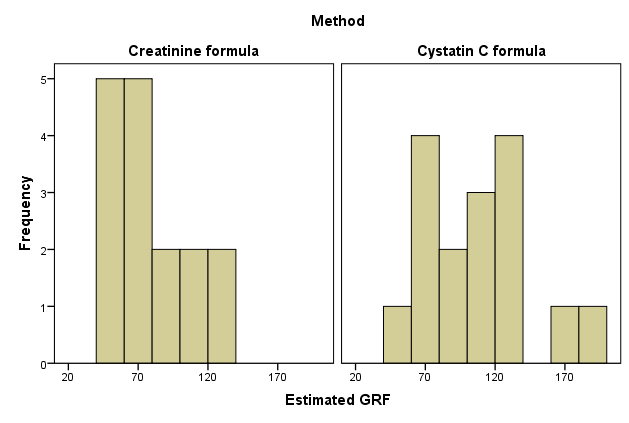
:::

::: {.column width="60%"}
|                   | Creatinine | Cystatin C |
|-------------------|------------|------------|
| Medelvärde        | 78         | 106        |
| Median            | 70         | 105        |
| Standardavvikelse | 27         | 36         |
| Min - Max         | 44 - 126   | 52 - 180   |
:::
:::
:::

-   Fördelningen ser INTE symmetrisk ut (varken för kreatinin- eller
    cystatin C-baserade uppskattningar; hur fördelas differenserna?)
-   Liten urvalsstorlek
-   =\> Vi kan inte använda det parametriska ”parat t-test”
-   =\> Behöver ett icke-parametriskt test!

::: notes
GFR (glomerulär filtrationshastighet) avser volymen blodplasma som per
tidsenhet renas fullständigt genom glomerulär filtration, detta benämns
absolut GFR (mL/min).
:::

##  {background-image="img/image65.jpg" background-size="contain"}

## SPSS

Parade data =\> Wilcoxon Signed Rank test

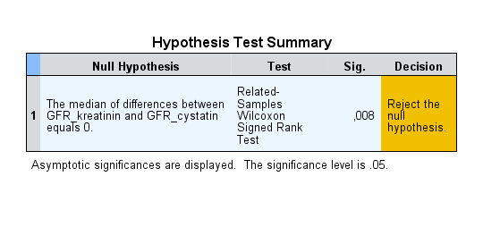

::: notes
Om du får en stor skillnad i de två rangsummor är det ett tecken på
positiv skillnad eller negativ skillnad mellan de två metoderna. Du
behöver en tabell för att hitta p-värdet (se eLabb för boken) eller, som
ovan, använda en programvara som SPSS.
:::

## Exempel: Nordisk hälsa

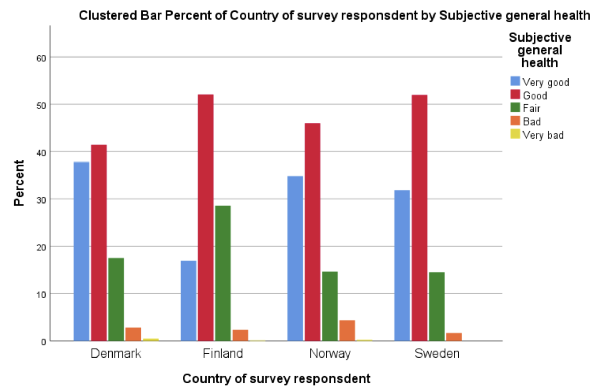

##  {background-image="img/image65.jpg" background-size="contain"}

## Finns skillnad?

Finns det någon skillnad i allmän hälsa mellan nordiska länder?

-   Utfallsvariabel?
    -   `generell hälsa`
-   Typ/skala på utfallsvariabel?
    -   Egentligen ordinal (kategorisk)
    -   Flödesschemat utgår dock från att man betraktar den som "continous"
        -   Om kvantitativ: antagande om normalfördelning?
            -   `NA`
-   Antal prediktorer (grupperingsvariabel)?
    -   `1` (Nordiskt land)
-   Typ/skala på oberoende variabel?
    -   `kategorisk` (nominal)
-   Hur många kategorier om det är en kategorisk prediktor:
    -   `> 2` (4: Danmark, Finland, Norge, Sverige)
-   Parade eller oberoende data?
    -   `oberoende`

## Kruskal-Wallis

Testar om stickprov (\> 2) kommer från samma fördelning.

Antaganden:

-   `Oberoende` observationer: Observationerna inom varje grupp eller
    kategori är oberoende av varandra.
-   `Homogenitet` av varians: Variansen för utfallsvariabeln är lika i
    alla grupper.
-   `Ordinalskala`: Utfallsvariabeln är mätt på en ordinalskala, vilket
    innebär att observationerna kan rangordnas.

##  {background-image="img/kruskal_wallis.png" background-size="contain"}

::: notes
df = 4 nordiska länder - 1
:::


## Exempel: höftprotes

-   Återhämtning av fysisk funktion efter total höftprotesoperation:
    Finns det någon skillnad i fysisk funktion `före` operation samt 3
    eller 6 månader `efter`?

-   Poäng för fysisk funktion (mätt med SF-36) är numeriska men inte
    normalfördelade och med en liten urvalsstorlek.

##  {background-image="img/image65.jpg" background-size="contain"}

## 

-   Utfallsvariabel?
    -   `SF-36`
-   Typ/skala på utfallsvariabel?
    -   `kvantitativ`
        -   Om kvantitativ: antagande om normalfördelning?
            -   `Nej`
-   Antal prediktorer (grupperingsvariabel)?
    -   `1` (tidpunkt)
-   Typ/skala på oberoende variabel?
    -   `kategorisk`(ordinal)
-   Hur många kategorier om det är en kategorisk prediktor:
    -   `> 2` (3: baseline, 3 månader, 6 månader)
-   Parade eller oberoende data?
    -   `parade`

##  {background-image="img/image65.jpg" background-size="contain"}

## Friedmans test

Baseras på rangordningen av observerade värden.

Antaganden:

-   Parade/upprepade mätningar (\>2 tillfällen)
-   Ordinalskala, intervallskala

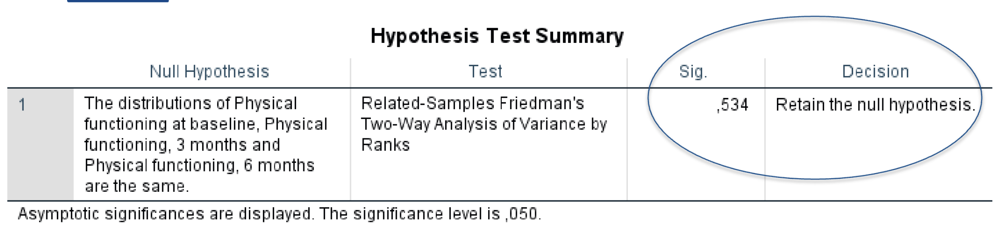

## Parametriskt eller icke-parametrisk?

-   Vilken information används?
    -   **Parametrisk**: Kunskap om fördelning och observerade värden
    -   **Icke-parametrisk**: Rangordningen för de observerade värdena
-   Vad är risken med parametriska tester?
    -   Om antagandena inte uppfylls =\> felaktiga slutsatser 👎
-   Varför använder vi inte alltid icke-parametriska tester?
    -   Om antagandena för parametriska test är uppfyllda så har dessa
        bättre `styrka` (power) att upptäcka skillnader

::: notes
8.6 (s139) Eftersom en parametrisk test är baserad på en antagande om
fördelning, kan all inferens vara felaktig om det antagandet är
felaktigt. Men om antagandet om fördelning är korrekt, kommer den
parametriska testen vara mer kraftfull och kan upptäcka skillnader
lättare jämfört med de icke-parametriska testerna. Det visar sig också
att p-värdet som beräknas baserat på ett icke-parametriskt test är
större än det som skulle erhållas från ett parametriskt test. Ett annat
argument för att inte rutinmässigt använda icke-parametriska metoder är
att de inte är lika flexibla som de parametriska alternativen.
:::

# Korrelation

## 

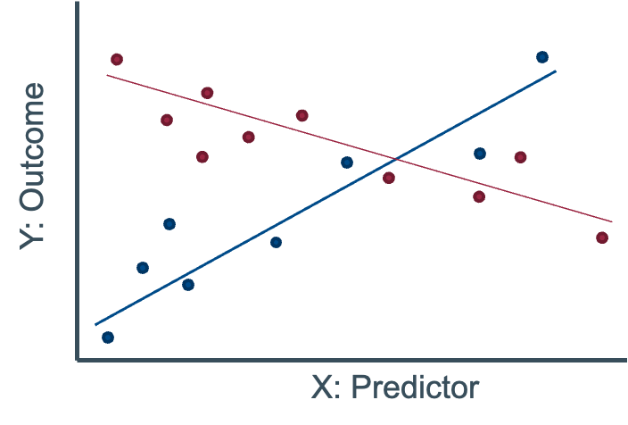

::: notes
Du mäter flera variabler på ett urval av försökspersoner. Du vill veta
om vissa (två, ..) variabler är relaterade på något sätt. Ger kunskap om
en variabel ledtrådar om den andra variabeln (på populationsnivå)?
:::

## linjärt samband

-   Pearsons `korrelationskoefficient`
-   Betecknas oftar $r$ eller $\rho$
-   Mäter det `linjära sambandet` mellan två kvantitativa variabler
-   Har ett värde mellan -1 och 1
    -   1 = perfekt ökande linjärt samband
    -   0 = inget linjärt samband
    -   -1 = perfekt minskande linjärt samband

::: notes
H0: ρ=0, i.e. correlation in the population = 0 Requires the variables
to be approximately normally distributed or a large sample size Note
that hypothesis testing is always done under the assumption that H0 is
true.
:::

##  {background-image="img/image27.png" background-size="contain"}

::: notes
NÄR är det lämpligt att använda Pearsons korrelationskoefficient?

Om du har kvantitativa variabler. Om du ser någon form av linjärt
samband/trend. Om du inte har uteliggare (outliers).

NÄR ska du inte använda Pearsons korrelationskoefficient? När du har -
ett icke-linjärt samband - uteliggare - "hål" i datan - stickprov från
olika grupper
:::

## 

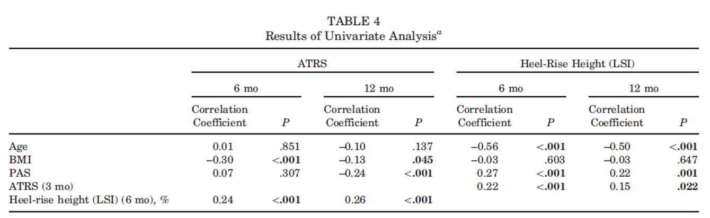

##  {background-image="img/paste-8.png" background-size="contain"}

$\rho = -0.56$

## Icke-linjärt samband

-   Vad händer om relationerna inte är linjära?

-   Korrelation mellan rangordning

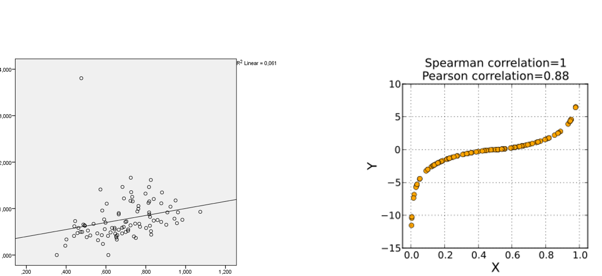

# Regression

## Linjär regression

-   Anta en matematisk `modell` som återspeglar verkligheten.
-   Baserat på detta vill vi `förutsäga` (predicera) en utfallsvariabel
    $Y$
    -   från en (eller flera) `oberoende variabler` $X$ (som är kända).
-   Flera typer av frågor kan besvaras med hjälp av regression:
    -   Har förekomst (diagnostisering?) av autism (ESSENCE-problematik)
        ökat under de senaste 2 decennierna?
    -   Botar ett nytt läkemedel allergi, eller leder det tvärtom till
        fler biverkningar?
    -   Hur stor är risken för bilolyckor under en viss period?

> "All models are wrong, but some are useful" --- George Box

## 

Den bäst anpassade räta linjen

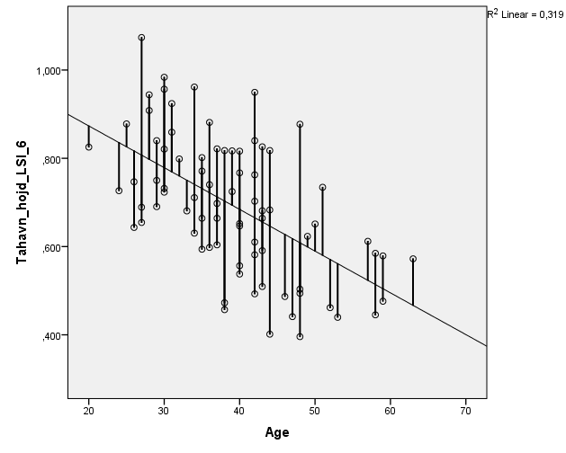

## Räta linjens ekvation?

-   $y = kx + m$ från grundskolan
-   Vi har dock inte en deterministisk relation
-   Slumpen $\varepsilon$ vill också vara med!
-   $y = kx + m + \varepsilon$
-   Av tradition särskiljer man ofta variabler ($x, y$) med latinska
    tecken från parametrar/koeficienter med grekiska tecken
    ($k \rightarrow \alpha, m \rightarrow \beta$)
-   Alternativt: $E[Y] = \alpha + \beta x$ där $E[X] =$ väntevärdet
    (tänk "medelvärdet" av $Y$)
-   $\varepsilon =$ kvarvarande "slump" som inte förklaras av modellen

::: callout-caution
## Different things but same names and same names but different things

-   I SPSS ges både $\alpha$ och $\beta$ i kolumn "B"
-   I regression betecknar $\alpha$ och $\beta$ något helt annat än
    tidigare (sannolikheten för typ I- och II-fel)!
-   Ibland kallar man $\alpha$ för $\beta_0$ och $\beta$ för $\beta_1$
:::

## Korrelation vs. regression

-   De är besläktade men inte samma sak.
-   Korrelation har ingen riktning från en variabel till en annan.
    Variablerna är korrelerade med varandra.
-   Linjär regression **antar** en "riktning": Resultatet ($Y$) sägs vara
    beroende av prediktorn ($X$).
-   Dock behöver inte riktningen vara "kausal" (orsaksbestämd) även om
    det ofta är vad man önskar!
-   Linjär regression är en matematisk modell:
    -   $E[Y] = \alpha + \beta X$

::: notes
Enkel linjär ekvation: Y = α + β\*X Parametrar α och β α kallas för
intercept (värdet av Y när X = 0) β kallas för linjens lutning En ökning
av X med en enhet → en ökning av Y med β enheter α och β representerar
värden för populationen a och b representerar de specifika
uppskattningarna av α och β
:::

## SPSS

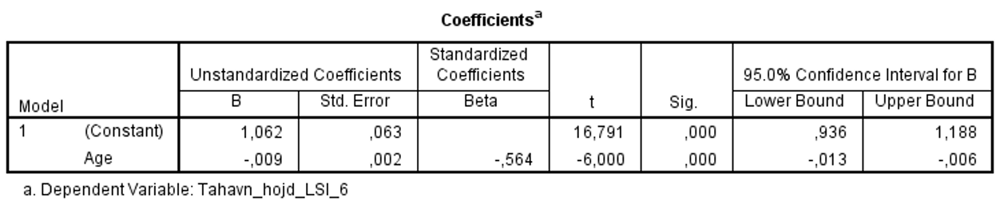

$E[Y] = \alpha + \beta X \Rightarrow Heel-rise \approx 1.062 – 0.009 \cdot Age$

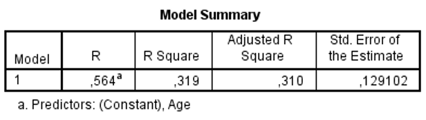

-   Hur bra är modellen?
-   Signifikans?
-   Konfidensintervall?

::: notes
En ökning med 1 enhet i ålder → en minskning med 0.009 enheter (på grund
av det negativa tecknet) i förväntad hällyftning. Förväntad hällyftning
vid ålder = 0 år är inte tillgänglig (ingen med ålder = 0), och
extrapolering kan ge orealistiska resultat.
:::

## Antaganden

Den linjära regressionen ger endast giltiga resultat om vissa antaganden
uppfylls:

-   Utfallsvariabeln är en skalvariabel
-   Linjärt samband mellan X och Y (eller en funktion av X;
    logtransformera?)
-   Residualerna ($\varepsilon = y - (\alpha + x\beta)$) är
    -   oberoende (på samma sätt som att säga att för varje värde på $X$
        är $Y$:na oberoende
    -   normalfördelade med medelvärde 0 och konstant avvikelse, för
        alla värden på $X$, dvs $\varepsilon \sim N(0, \sigma^2)$ för
        ngt $\sigma^2$

## Multipel regressionen

> "Justera (kontrollera) för andra variabler"

Enkel/simpel/univariabel regression

:   som ovan (endast en $X$-variabel)

Multipel/multivariabel regression

:   flera prediktorer/riskfaktorer samtidigt
    ($E[Y] = \alpha + \beta_1X_1 + \beta_2X_2 + \ldots + \beta_kX_k$)

:::: fragment
::: callout-warning
## Multivariat regression
Multivarat regression har flera utfallsvariabler ($Y$). 
Ej att förväxla med multipel/multivariabel regression!
:::
::::


## Modellbygge

Modellbygge är komplicerat!

-   Välja potentiellt förklarande variabler med hjälp av medicinsk
    kunskap.
-   Kan underlätta med Directed Acyclic Graphs (DAG) (online-verktyg:
    dagitty.net)
-   Plotta och "lär känna" data
-   Undvik starkt korrelerade prediktorer (kolienaritet) om syftet är en
    tolkningsbar modell
-   Börja med enkla modeller (eng: parsimonious; Ockhams rakkniv)
-   Lite olika tillvägagångssätt för förklarande resp predicerande
    modeller (även om matematiken är densamma)

::: notes
Utforskande: Vilka variabler är relaterade/kopplade till utfallet
Justering: Justera för förvirrande/bakgrundsfaktorer Utfallsvariabler:
Kontinuerliga, Binära, Tid till händelse Prediktor/Förklarande: Vilken
kombination av kontinuerliga, binära och kategoriska variabler som helst
:::

## Simpsons paradox

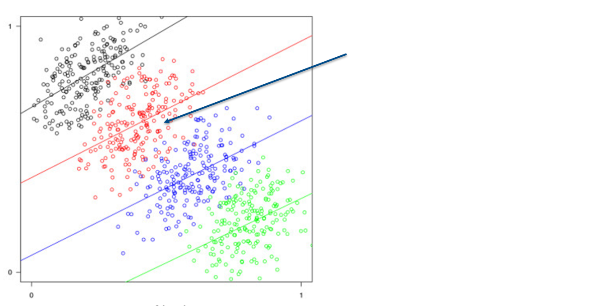

::: notes
https://en.wikipedia.org/wiki/Simpson%27s_paradox

Sambandsdiagram över korrelationen mellan två kontinuerliga variabler X
och Y, grupperade efter en nominal variabel Z. Olika färger
representerar olika nivåer av Z.

Simpsons paradox: En trend syns i flera olika datagrupper men försvinner
eller ändrar riktning när dessa grupper kombineras.
:::

## Exempel LSI

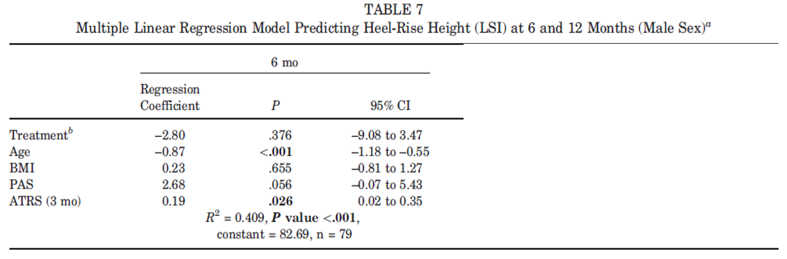

-   $E[LSI] = 82.69 − 2.80 \cdot Treatmen_{𝑛𝑜𝑛𝑠𝑢𝑟𝑔𝑖𝑐𝑎𝑙} − 0.87 \cdot Age + 0.23 \cdot 𝐵𝑀𝐼 + 2.68 \cdot PAS + 0.19 \cdot ATRS_{3m}$
-   $R^2 = 0.409 \Rightarrow$ Modellen förklarar cirka 41 % av
    variationen i LSI

# Kvalitativt utfall

## Kvalitativa (kategoriska) utfallsvariabler

-   Utfallsvariabler som är:
    -   `Nominalskala` (kön, ögonfärg, …) utan inbördes ordning
    -   `Ordinalskala` (Bra-Bättre-Bäst, Ålderskategorier) har en
        naturlig ordning
-   "Avståndet mellan stegen är inte definierat”
-   De kan bara ta ett fåtal möjliga värden


## Exempel: biverkningar

Vi vill undersöka om förekomsten av biverkningar skiljer sig mellan två behandlingsgrupper: en som får ett nytt läkemedel och en som får placebo.

- **$H_0$**: Ingen skillnad i andelen biverkningar mellan grupperna.
- **$H_1$**: Finns skillnad i andelen biverkningar mellan grupperna.

## Samband mellan kategoriska variabler

-   `Pearsons` $\chi^𝟐$-test
    -   Vanligt test för valfritt antal rader och kolumner
    -   kräver att förväntat värde i minst 80 % av cellerna är \> 5
-   Pearsons $\chi^2$-test jämför `förväntat` antal med `observerat`
    antal
-   Om det finns en STOR diskrepans så får vi ett litet p-värde
-   Då förkastar vi $H_0$ och drar slutsatsen att det finns ett samband
-   Annars misslyckas vi med att förkasta $H_0$

:::: fragment
::: {.callout-important}
`Fishers exakta test` räknas mer exakt och kan också användas för små tal (\< 5 obs. i varje cell).
Använd det om du/datorn orkar!
:::
::::

## Exempel

Detta är vad vi observerar:

| Grupp       | Biverkning | Ingen biverkning | 
|-------------|------------|-------------------|
| Läkemedel   | 30         | 70                |
| Placebo     | 40         | 160               |


🤔 Men vad skulle vi istället förvänta oss givet $H_0$?

::: fragment
🤓 Börja med att beräkna marginalsummor:

| Grupp       | Biverkning | Ingen biverkning | Totalt |
|-------------|------------|-------------------|-------------|
| Läkemedel   |      30      |    70               | $R_1 = 100$ |
| Placebo     |      40      |   160                | $R_2 = 200$ |
| **Totalt**  | $C_1 = 70$ | $C_2 = 230$       |   $N = 300$ |

:::

::: fragment
Sedan ges det förväntade av: $E_{ij} = \frac{R_i \cdot C_j}{N}$

| Grupp       | Biverkning                                     | Ingen biverkning                              | Totalt |
|-------------|-----------------------------------------------|-----------------------------------------------|---------
| Läkemedel   | $E_{11} = \frac{100 \cdot 70}{300} = 23.33$    | $E_{12} = \frac{100 \cdot 230}{300} = 76.67$  | 100 |
| Placebo     | $E_{21} = \frac{200 \cdot 70}{300} = 46.67$    | $E_{22} = \frac{200 \cdot 230}{300} = 153.33$ | 200 |
| **Totalt**  | 70         | 230               | 300    |
:::

:::: fragment
::: callout-note
Dvs, vi förväntar oss minst 5 fall i samtliga celler och kan då använda $\chi^2$-testet!
:::
::::

::: fragment
Hur mycket skiljer sig det förväntade från det observerade?

$$\chi^2_{ij} = \frac{(O_{ij} - E_{ij})^2}{E_{ij}}$$


| Grupp       | Biverkning                                          | Ingen biverkning                                  |
|-------------|----------------------------------------------------|--------------------------------------------------|
| Läkemedel   | $\chi^2_{11} = \frac{(30 - 23.33)^2}{23.33} = 1.90$ | $\chi^2_{12} = \frac{(70 - 76.67)^2}{76.67} = 0.58$  |
| Placebo     | $\chi^2_{21} = \frac{(40 - 46.67)^2}{46.67} = 0.95$ | $\chi^2_{22} = \frac{(160 - 153.33)^2}{153.33} = 0.29$ |

Totalt: $\chi^2 = 1.90 + 0.58 + 0.95 + 0.29 = 3.72$

:::

::: fragment

- Frihetsgrader ($df$): $df = (r - 1)(c - 1) = (2 - 1)(2 - 1) = 1$
- Kritiskt värde vid $\alpha = 0.05$ och $df = 1$ är $3.84$
- Eftersom $3.72 < 3.84$, kan vi inte förkasta $H_0$.
- Det finns ingen signifikant skillnad i andelen biverkningar mellan patienter som fick läkemedlet och de som fick placebo ($\chi^2 = 3.72$, $p > 0.05$).

:::

## Binärt utfall

-   Två möjliga utfall:
    -   `0`: falskt, nej, inget, ...
    -   `1`: sant, ja, något, ...
-   Dvs $x = 0$ eller $x = 1$

sannolikhet

:   för $x = 1$ betecknas $p$ och skattas som $\bar x$

:   $P(X = 1) = p \approx \bar x = \hat{p}$

odds

:   $P(x = 1) / P(x = 0) = p/(1-p)$

## Från två grupper

-   Anta att vi har värden:
-   $X_S = (1, 1, 0, 1, 0)$ från Stockholmare och
-   $X_G = (0, 1, 0, 0, 0)$ från Göteborgare.
-   $\bar x_S = \bar p_S = 3/5 = 0.6$ och $\bar x_G = \hat p = 1/5 = 0.2$
-   Odds för Stockholm: $0.6/(1-0.6) = 1.5$
    -   $1.5 > 1$, dvs det är mer sannolikt för Stockholmare att ha
        $x = 1$ jmfrt med att inte ha det.
-   Odds för Göteborgare: $0.2/(1-0.2) = 0.25$
    -   $0.25 < 1$, mindre så för Göteborgare

::: fragment

Prevalens/"risk"

:   $=p$ för respektive grupp
:::

::: fragment

Prevalenskvot/relativ risk (RR)

:   $p_S/p_G = 0.6/0.2 = 3$

:   prevalensen är 3 ggr så hög i Stockholm
:::

::: fragment

Oddskvot (odds ratio; OR)

:   kvoten av Odds

:   $1.5 / 0.25 = 6$

:   Hur tolkar vi detta?
:::

::: fragment
RR och OR har samma riktning men magnituden skiljer. Ligger dock ganska
nära varandra för låga värden.
:::

## Test

-   Några vanliga sätt att jämföra binära data från oberoende grupper:
    -   `Chi2-test` ($\chi^2$-test)
    -   Differens mellan oberoende andelar
    -   Kvot mellan oberoende andelar
        -   Tvärsnittsstudier (cross-sectional) – `Prevalenskvot`
        -   Kohort/uppföljningsstudier – `Relativ risk` (RR)
    -   Kvoten mellan oberoende odds i fall-kontrollstudier – `Oddskvot`
        (OR)

::: notes
Riskdifferensen (eller absolut riskreduktion) svarar på frågan: Hur
många färre fall kan förväntas om vi ger denna specifika behandling till
t.ex. 100 patienter? Formeln för en 95% konfidensintervall för
riskdifferensen är: 𝐷±𝑘√((𝑞_1 (1−𝑞_1 ))/𝑛_1 +(𝑞_2 (1−𝑞_2 ))/𝑛_2 ) där q1
och q2 är andelarna av sjukdomsfria överlevande (DFS), n1 och n2 är
gruppstorlekarna.

Relativ risk (eller riskkvot) är en kvot av risken för en händelse
(t.ex. sjukdom eller återfall) som inträffar i två olika grupper. Den
svarar på frågan: Hur mycket mer sannolikt är det att patienter får
(t.ex.) återfall om de får den mindre framgångsrika behandlingen? Formel
för: 𝑹𝑹=𝒒_𝟐/𝒒_𝟏 där q1 och q2 är andelarna av återfall i grupp 1 och 2,
respektive.
:::

## Logistisk regression

-   $Y \in \{0,1\}$
-   Kan vi använda linjär regression? 🙋‍♂️
    -   Nej, för få möjliga utfall 👎
-   Betrakta istället sannolikheten: $P(Y = 1) = p \approx \bar x$
-   Linjär regression nu då? 🤷‍♂️
    -   Nej, för snävt intervall $(0,1)$ 🧐
-   Men om vi tar oddset då? 🤓
    -   Ok då, men logaritmera först! 👍
-   Och de intressanta resultaten ges av (logaritmerade) oddskvoter!
-   Fast då heter det logistisk regression: 👆
    -   **En** prediktor -\> `Enkel` (simple) `logistisk regression`
    -   **Flera** prediktorer -\> `Multippel logistisk regression`

::: notes
Simple – short Campbell. M.. Machin. D.. & Walters. S. (2010). Section
9.6 Logistic Regression. Medical Statistics : A Textbook for the Health
Sciences. New York: John Wiley & Sons

A gentle & detail introduction to Logistic regression with Stata\
Vittinghoff. E.. Glidden. D.. Shiboski. S.. & McCulloch. C. (2012).
Chapter 5. Logistic Regression. Regression Methods in Biostatistics
(Statistics for Biology and Health). Boston. MA: Springer US.
https://ebookcentral-proquest-com.ezproxy.ub.gu.se/lib/gu/detail.action?docID=973179
:::

## Exempel

Multipel logistisk regression

-   Fråga: Påverkar rökning risken för diabetes?
-   Utfall, $Y$: Diabetesdiagnos (1= Ja, 2= Nej)
-   Oberoende variabler:
    -   Rökare: 1= Ja (nuvarande), 2= Nej (icke-rökare REF.)
    -   Kön (1 = Man, 2 = Kvinna REF.)
    -   Ålder (år)
    -   BMI

## 

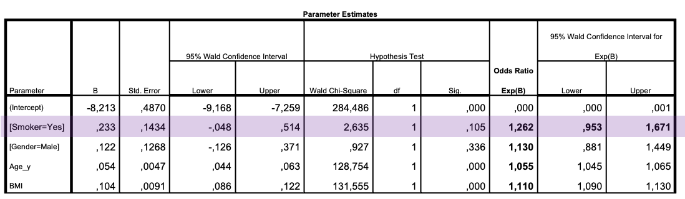

-   Oddskvoten för rökare jämfört med icke-rökare för att ha diabetes är
    1,26.
-   Dvs, rökare i denna studie har 1,26 gånger så höga odds att ha
    diabetes (= 26 % högre).
-   Dock är detta inte en signifikant prediktor
    -   eftersom 95% CI inkluderar ETT och $p > 0,05$.
-   Förresten... Skriv aldrig $p=0,000$ i en rapport! Det bör vara
    $p<0,001$.

::: notes
Mer än en oberoende (prediktor/förklarande) variabel (Multi-prediktor
Modell) Dikotom, ordinal, nominal, kontinuerlig ... ln⁡〖(𝑝/(1−𝑝))=𝛼+𝛽_1
𝑥_1+𝛽_2 𝑥_2+…+𝛽_𝑛 𝑥_𝑛 〗 Tolkning av 𝛽_1 Ökning av log-odds för en
enhets ökning av x1 med alla andra xi konstanta (i=2,….,n) Mäter
sambandet mellan x1 och log-odds justerat för alla andra xi (i = 2,….,n)
:::

## Upprepade mätningar

Observera att `longitudinella` studier med fler än 2 mätningar per
individ kräver andra typer av statistiska metoder.

::: callout-tip
Behöver du analysera sådan data rekommenderas t ex ANOVA för upprepade
mätningar eller mixade modeller (mixed models; som också går under en
rad andra namn). Detta bygger på att din handledare kan vägleda dig kring dessa metoder. 
Försök annars omformulera frågeställningen!
:::

# Överlevnadsanalys

## Benämning

-   Eng: survival analysis
-   Eg bättre: "Tid-till-händelse-analys" (time-to-event analysis)
-   Stort fält med många olika tekniker
    -   Kaplan-Meier och Cox-regression vanligast

## Tid och händelse

-   Startpunkt
    -   diagnosdatum
    -   indexdatum (matchade kontroller)
    -   operationsdatum
    -   ...
-   Slutpunkt
    -   död (därav namnet)
    -   re-operation/revision
    -   återfall/recidiv
-   Tid
    -   Antalet dagar (oftast) från start till slut

## Varför?

-   🙋‍♂️ Detta låter enkelt: Om antalet dagar är en skal-variabel så kan
    vi väl använda linjär regression?
    -   👍 Ja, om vi verkligen har komplett data
    -   👎 Men ofta har vi inte det!
-   🙋‍♂️ Eller om utfallet bara är död/levande kan vi väl använda
    logistisk regression?
    -   Ja, men begränsas då till död inom en viss tid.
    -   I praktiken får denna tid vara relativt kort om vi inte vill
        vänta med analysen tills dess att data blivit helt inaktuell.

## Censurering

-   Alla som inkluderas har (oftast) en starttid
-   Men har alla en sluttid?
-   Ska vi vänta tills alla dör?
-   Ska vi ignorera dem som inte hinner dö innan vi analyserar data?
-   Eller kan vi ändå nyttja det vi vet? Dvs, vi vet åtminstone att
    individen ännu inte dött efter ett visst antal dagar?
-   Vet vi inte längre om individen är död eller levande så är denna
    information `censurerad` från och med denna tidpunkt
-   Ett vanligt antagande är att censurering inträffar oberoende av
    utfallet

## Olika sorter

-   höger, vänster, intervall
    -   Vi fokuserar på höger-censurering
        -   känd startpunkt
        -   tillåter okänd slutpunkt
-   "loss-to-follow-up"
    -   Forskningspersoner avbryter sitt studiedeltagande
    -   personer emigrerar (försvinner ur svenska register)
-   Administrativ censurering
    -   Vi orkar inte vänta tills alla dör
-   Censureringsdatum: sista datumet för vilken information om utfallet
    var känt (oavsett orsak):
    -   Senast genomförda uppföljningsbesök
    -   Datum för emigrering enligt folkbokföringen/Skatteverket/Navet
    -   Datum då datauttag gjordes från kvalitetsregister

## Variabler

-   Tid ($t$): Antal dagar
-   Status ($s$): Den händelse som inträffat efter $t$ dagar
    -   `0` om individen vid detta datum fortfarande lever
    -   `1` om individen dog vid detta datum

##  {background-image="images/paste-20.png" background-size="contain" background-color="white"}

## Life tables

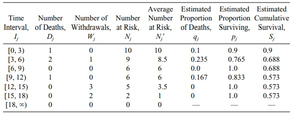

## Kaplan-Meier

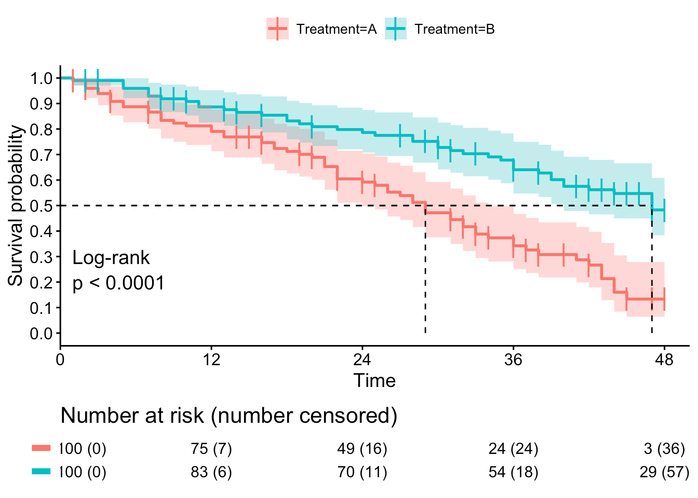

## För- och nackdelar

### Fördelar

-   Ger en tydlig grafisk representation
-   Lätt att utläsa andelen ännu levande efter viss tidpunkt

### Nackdelar

-   Bara EN kurva
    -   Vill man ha fler får man stratifiera stickprovet
-   Kan inte "justera för" fler variabler
    -   om man inte stratifierar alla kombinationer
    -   Finns dock även justerade Kaplan-Meier kurvor men är ganska
        ovanligt (och svåra att tolka).

## Cox-regression

### Fördelar

-   Kan justera för flera variabler

### Nackdelar

-   Inte lika lätt att tolka (modellerar relativa hazarder)
-   Kräver antaganden (propertionerliga hazarder)
    -   Finns dock varianter för tidsberoende data
-   värdet beror på uppföljningstiden (men utan att vara lika explicit
    som KM)
-   Svårt att illustrera grafiskt

## Hazard

-   Cox-regression är en semi-parametrisk modell
    -   hazarden $\lambda$ parametriseras
    -   "baseline-hazarden" kan förbli okänd
-   $\lambda =$ sannolikheten att händelsen inträffar väldigt snart
    efter en viss tidpunkt. Tänk frekvens!
-   Hazardkvoter: $\lambda_1/\lambda_2$
    -   = 1: ingen skillnad mellan två grupper
    -   $\neq 1$: Individer i ena gruppen dör med högre (lägre)
        frekvens än i den andra

## Använda båda?

-   Eftersom både KM och Cox-regression har för- och nackdelar kan man
    använda båda!
-   De svarar dock på olika frågor (andelen kumulativt överlevande resp.
    hazardkvoter)
-   I löpande text kan man presentera andelen som ännu inte dött (eller
    dess motsats) vid en kliniskt relevant tidpunkt (30 dagar, 3
    månader, 1, 3, 5 eller 10 år?)

## Enkla mått?

-   Om minst hälften dör under studietiden så kan man presentera
    mediantiden för detta
-   Medelvärdet kan vi dock inte beräkna om vi inte har komplett
    uppföljning
-   Restricted mean survival time (RMST) är ett alternativ som räknar
    medeltiden individer lever under en begränsad tid


# Datastruktur

## Innan analys: Organisera data

I Excel, SPSS eller ett annat program

-   En variabel per kolumn
-   En individ (t.ex. patient) per rad
-   Ett variabelvärde per cell
-   Variabelnamn i första raden
    -   Helst bara A-Z/a-z, siffror respektive "\_"
-   Inga tomma rader
-   Tom cell betyder saknad data (0 och saknad data är två olika saker)
-   Inga kommentarer i datafilen

## ❌ Fel

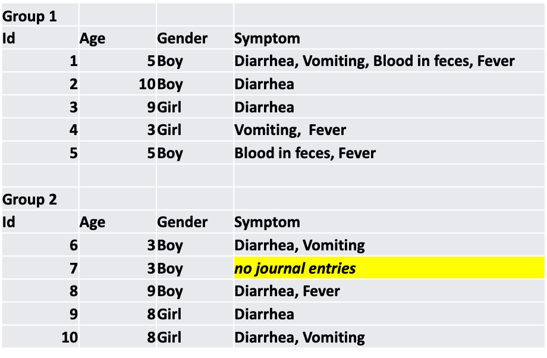

## ✅ Rätt!

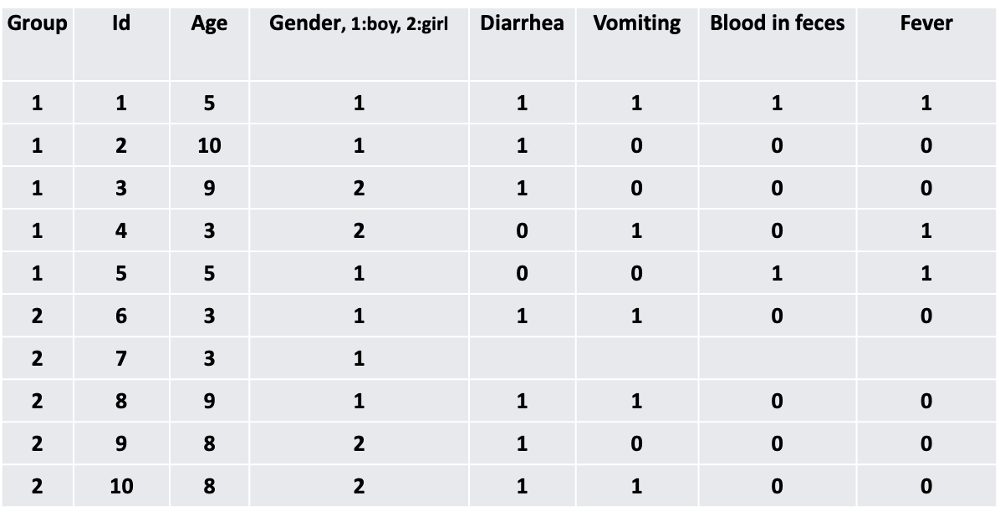
[Tidy data](https://vita.had.co.nz/papers/tidy-data.html) är et relevant kocept! 

## Komplexa datakällor

- Om du får många dataset från t ex kvalitetsregister och andra källor kan du behöva kombinera dessa
- Undvik detta om du inte är taggad på en utmaning/har gott stöd av handledaren/har viss kännedom om datastrukturer 
- Går till viss del i SPSS men kan motivera att välja t ex R istället?

---------------------------------------------

::: callout-important
## Viktigt!

-   Tänk på urvalsstorlek `innan` studien påbörjas
-   Försök att ange så mycket som möjligt i `studieprotokollet` innan du
    börjar samla in och analysera data
-   När du har data: `plotta/tabulera` alltid data
-   Utvärdera `antaganden`
-   Inkludera/exkludera endast observationer (t ex outliers) på ett
    vetenskapligt korrekt sätt (vad nu det ska betyda ...)
:::

# Forskningsfrågan

## Vad är en forskningsfråga?

-   En forskare bör ställa en mycket specifik fråga.
-   Breda frågor bryts vanligtvis ner i mindre frågor.
-   En bra kvantitativ forskningsfråga kan leda till en testbar hypotes.

## Dålig fråga

-   En fråga som inte spelar någon roll för någon (inte ens för dig)
    -   Den måste vara användbar på ett eller annat sätt...
    -   (... fast kanske inte det primära syftet just i detta fall ...
        fortsatt relevant som lärtillfälle)
    -   Och i grundforskning kan det ta lång tid innan den kliniska
        relevansen uppdagas (inom matematik upp till 300 år!)
-   Hoppas på att en fråga ska framträda från rutinmässiga kliniska
    journaler
    -   Journalerna kommer att vara partiska och förvirrade
    -   De kommer att sakna den information du behöver för att
        tillförlitligt svara på din fråga, eftersom de skrevs av en
        annan anledning
-   Fisketur/trålning - samla in ny data och hoppas på att en fråga ska
    framträda

## Bra fråga

FINER-kriterierna

-   `F`easeble/Genomförbar (Svarbar med en robust metod och inom din
    begränsade tidsram)
-   `I`ntressant
-   `N`ydanande (Kanske inte den viktigaste i just detta sammanhang)
-   `E`tiskt
-   `R`elevant

::: notes
https://www.atsu.edu/research/pdfs/campbell_syllabus.pdf

FINER-kriterierna för en bra forskningsfråga • Genomförbar: Tillräckligt
antal deltagare, Tillräcklig teknisk expertis, Rimligt i tid och pengar,
Hanterbart i omfattning • Intressant, Intressant för forskaren •
Nydanande: Bekräftar eller motbevisar tidigare resultat, Utvidgar
tidigare resultat, Ger nya resultat • Etisk • Relevant: För vetenskaplig
kunskap, För klinisk och hälso- och sjukvårdspolicy, För framtida
forskningsriktningar
:::

## Exempel

Förklarar en skillnad i `___________________` (*oberoende variabel*)
skillnader i `___________________` (*beroende variabel*), med kontroll
för effekterna av `___________________` (*kontrollvariabel*)?

::: fragment
> Förklarar en skillnad i `behandling` skillnader i
> `maximal hällyftningshöjd,` med kontroll för effekterna av
> `ålder och BMI`?
:::

-   Observationsstudier
    -   Vad är sambandet mellan långväga pendling och ätstörningar?
-   Experimentella studier
    -   Leder konsumtion av snabbmat till ätstörningar?
    -   Vad säger FINER-kriterierna om det (Etiken?)

## PICO/SPICE

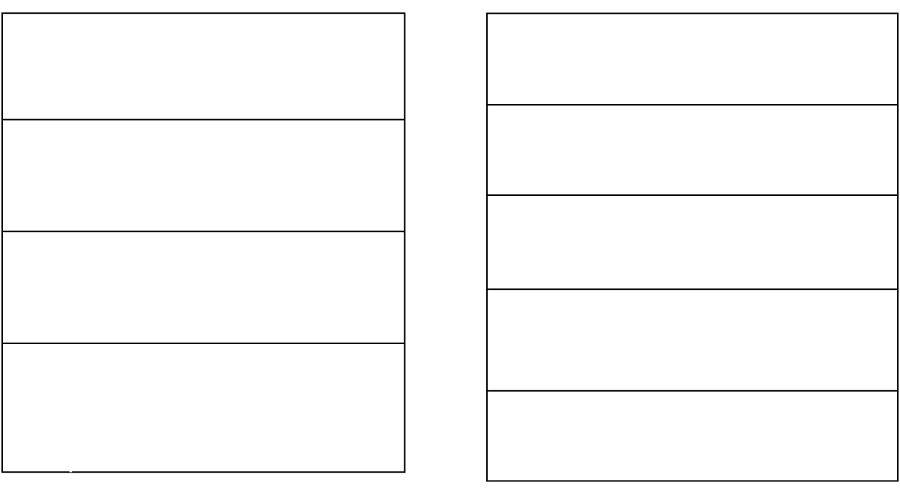

::: notes
PICO P - Who are the patients / What’s the problem? I - What is the
intervention (or exposure)? C – What is the control group? O - What is
the outcome?
:::

## Några online-riktlinjer

[Equator-nätverket](http://www.equator-network.org/)

:   Förbättrar kvaliteten och transparensen i hälsorelaterad forskning

:   Riktlinjer för rapportering och länkar till resurser för
    forskningsrapportering

[Codex](http://www.codex.uu.se)

:   Regler och riktlinjer för forskning

:   Information om de riktlinjer, etiska koder och lagar som reglerar
    och ställer etiska krav på forskningsprocessen.

# Studie-design

## Alternativ

```{mermaid}
%%| file: studiedesign.mmd
```

::: notes
Valet av en viss design beror på forskningsfrågan och andra förhållanden
(etiska frågor, ekonomiska, etc).

Kohort = "en grupp av individer som följs eller spåras under en period
av tid" A dictionary of Epidemiology - Oxford University Press Print
ISBN-13: 9780195314496 DOI: 10.1093/acref/9780195314496.001.0001
:::

## Experimentell studie

-   identifiera deltagare (inklusions- ock exklusionskriterier)
-   randomisera
-   intervenera
-   observera effekten
-   analysera

```{mermaid}
  graph TD
    A[Studiedesign] -->|Manipulera| B[fa:fa-flask Experimentell]
    A -->|Observera| C[fa:fa-eye Observationell]
    B --> |Följ upp| D[fa:fa-hospital Klinisk prövning]
    C --> |Följ INTE upp| E[fa:fa-user-clock Tvärsnittstudie]
    C --> |Följ upp| F[fa:fa-calendar-alt Longitudinell]
    F --> G[fa:fa-users Kohortstudie]
    F --> H[fa:fa-user-friends Fall-kontroll-studie]
    subgraph Experimentell
      B
      D
    end
```

## RCT {background-image="images/paste-11.png" background-size="contain"}

## Bu eller bä

-   👍 **Fördelar**
    -   "Guldstandard" för att fastställa orsakssamband/`kausalitet`
        (fortfarande inte enkelt...)
    -   Minskar (eliminerar?) påverkan av förväxlingsfaktorer
        (confounders) genom randomisering.
        -   Behöver (kanske?) inte justera för förväxlingsfaktorer
        -   Förenklar de statistiska analyserna
    -   Blinding är ibland möjligt (kanske svårt vid kirurgi?)
-   👎 **Nackdelar**
    -   Dyrt och tidskrävande
    -   Ibland etiska problem
    -   Urvalsbias
        -   Det som fungerar i en artificiell studie kanske inte
            fungerar i "verkliga livet".

## Crossover trials

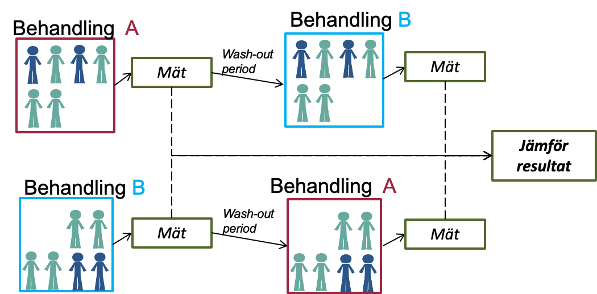{style="filter: invert(1)"}

## Bu eller bä

-   👍 **Fördelar**
    -   Alla deltagare fungerar som sina egna kontroller
    -   Felvarians minskas → mindre provstorlek behövs
    -   Alla deltagare får behandling
    -   Blinding kan användas
-   👎 **Nackdelar**
    -   Alla deltagare får placebo/alternativ behandling vid något
        tillfälle
    -   "Wash-out"-perioden är lång eller kan vara okänd
    -   Fungerar inte för behandlingar med permanenta effekter

## Observationell

-   identifiera deltagare (inklusions- ock exklusionskriterier)
-   observera vad som händer
-   analysera

```{mermaid}
  graph TD
    A[Studiedesign] -->|Manipulera| B[fa:fa-flask Experimentell]
    A -->|Observera| C[fa:fa-eye Observationell]
    B --> |Följ upp| D[fa:fa-hospital Klinisk prövning]
    C --> |Följ INTE upp| E[fa:fa-user-clock Tvärsnittstudie]
    C --> |Följ upp| F[fa:fa-calendar-alt Longitudinell]
    F --> G[fa:fa-users Kohortstudie]
    F --> H[fa:fa-user-friends Fall-kontroll-studie]
    subgraph Observationell
      C
      E
      F
      G
      H
    end
```

## Bu eller bä

-   👍 **Fördelar**
    -   Etiskt säkert
    -   Troligtvis mindre resurskrävande
-   👎 **Nackdelar**
    -   Exponering kan vara kopplad till en dold förväxlingsfaktor
    -   därmed mycket svårare att uttala sig om kausalitet
    -   Blinding är svårt
    -   För sällsynta sjukdomar krävs stor urvalsram (om befintliga data
        nyttjas)

## Hur välja?

-   Finns data redan insamlad? I så fall är valet redan gjort!
-   Vad är ditt utfall?
-   Vanligt eller ovanligt
    -   har vi tillräckligt stort stickprov för att skatta prevalensen
        av en väldigt ovanlig åkomma?
    -   Incidensen kräver ännu större stickprov
    -   associationer eventuellt ännu mer
-   Tidsram
    -   Prospektiv eller retrospektiv (historisk kohort)
    -   Intresserad av förändringar över tid eller en enskild tidpunkt?
-   Naturlig gruppering av deltagare?
    -   Exponerade vs. icke-exponerade
    -   Sjuka vs. friska

::: notes
Different definition of Retrospective or prospective exists in
litterature
:::

## Tvärsnittsstudier

Tvärsnittsdata är en ögonblicksbild av populationen, där exponeringen
och utfallet mäts samtidigt.

-   Användbart för att beskriva variabler och deras fördelningsmönster.
-   Kan användas för prevalensskattning (inkl kvoter)
-   Lättast för tillstånd som är relativt vanliga med lång varaktighet
    (icke-dödliga, kroniska tillstånd)
-   Svårare studera sällsynta, mycket dödliga sjukdomar eller sjukdomar
    med kort varaktighet
-   Inte lämpligt för att dra kausala slutsatser

::: notes
Cross-sectional studies involve point prevalence, not incidence. For
very infrequent diseases they are of limited utility
:::

## Kohortstudie

> "Bäst för att studera effekterna av riskfaktorer på en utfall"

-   `Prospektiva` kohortstudier börjar med en grupp (kohort) friska
    deltagare och jämför exponerade mot icke exponerade =\> är de som är
    exponerade mer benägna att bli sjuka?
-   Data kan samlas under studiens gång eller baseras på historiska data
    (register etc som då fortfarande kan ha haft en prostepktiv
    datainsamling då det begav sig).
-   `Ingen randomisering` av exponering/behandling.
-   Effekter kan vara confounded (behandling given på grund av specifik
    indikation). Vad är då effekten av vad?

## 

Resultatet av kohortstudier:

-   **Incidens/relativ risk för incidens** "Rökare har 3 gånger högre
    sannolikhet att utveckla hjärt-kärlsjukdom jämfört med icke-rökare."

-   **Överlevnad** "Patienter som fick behandling $A$ hade dubbelt så
    stor sannolikhet att överleva minst 5 år, jämfört med de patienter
    som fick behandling $B$." (Men berodde skillnaden på behandlingen?)

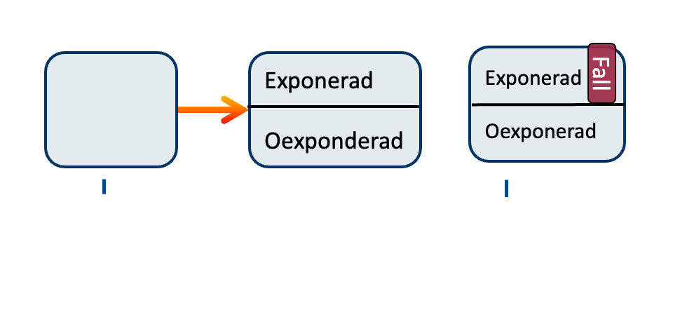

## Fall-kontroll-studie

-   `Prospektiva kohortstudier` kan ibland vara omöjliga att genomföra
    -   Tiden från exponering till sjukdom kan vara mycket **lång**
        -   Börjar röka som tonåring -\> hjärtsjukdom som vuxen;
            behandlas för leukemi som barn -\> påverkar fettfri
            kroppsmassa som vuxen
-   Sjukdomen är mycket `sällsynt`: antag 5/100 000. För att identifiera
    "tillräckligt" många fall (som krävs för statistisk styrka) kan det
    behövas en kohort på 1 000 000 deltagare
-   Ett alternativ är `Fall-kontroll-studie`

## 

En grupp `fall` och en grupp jämförbara `kontroller` (inte fall), titta
tillbaka i deras förflutna; jämför fall mot kontroller hur ofta
riskfaktorn är närvarande

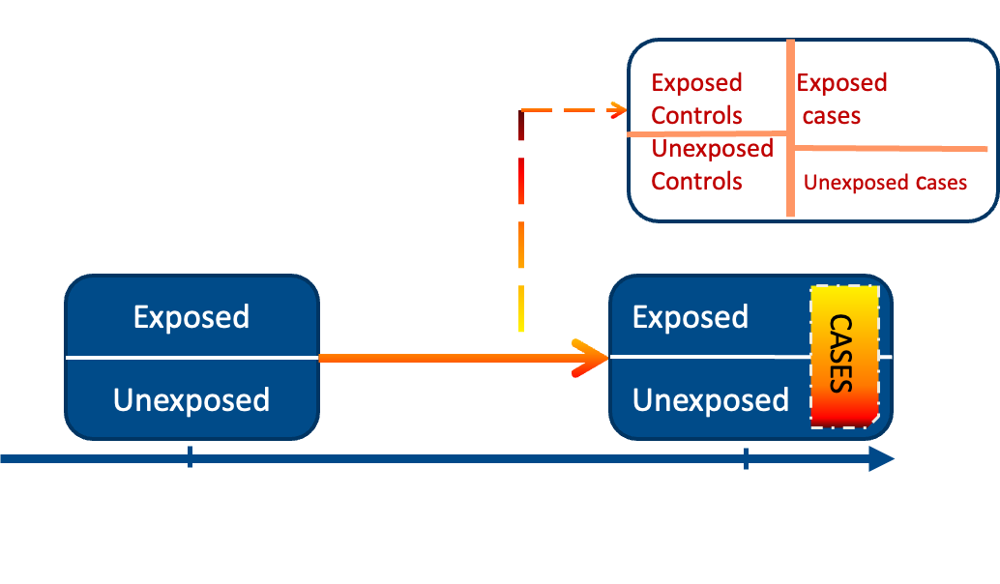

## 

-   Fall-kontroll-studier börjar med en grupp `fall` och inkluderar
    sedan ett slumpmässigt urval av `kontroller` (ingen sjukdom under
    studien!)
-   Bestäm tidskomponenten: titta tillbaka 20 år, 1 år, 1 månad?
-   Kartlägg exponering för varje fall och kontroll:

::: fragment
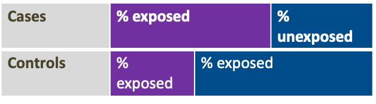

Beräkna

:   `oddskvoter`

:   jämför oddsen för att vara exponerad bland fall med oddsen för
    exponering bland kontroller
:::

##  {background-image="img/new_study_deisgn.png" background-size="contain"}

## Sist men inte minst ...

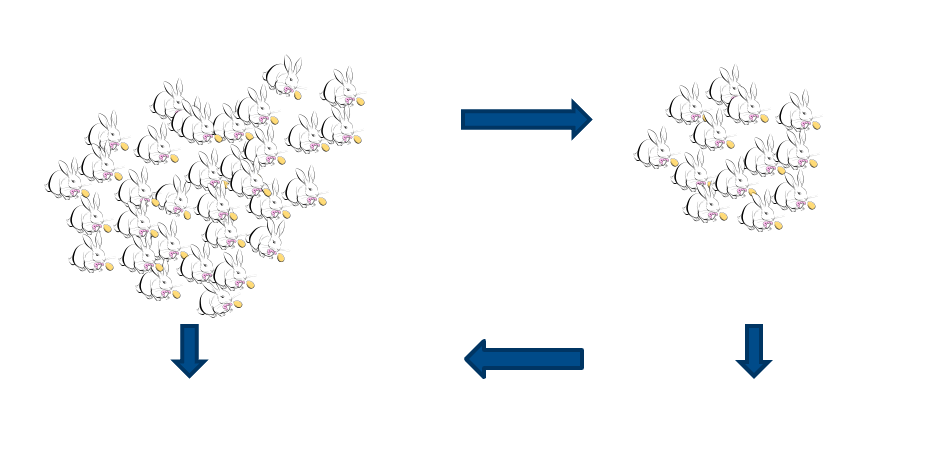

::: callout-caution
## Skit in, skit ut!

Oavsett vilken studieutformning som väljs kommer slutsatserna endast
vara giltiga om du valde "rätt" kaniner att titta på!
:::
